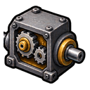

# 아이템·레시피 도감

MineValley의 아이템과 제작법을 이름, 획득처와 사용처로 찾아보는 공간입니다. 단순한 전체 목록보다 생산 단계에 따라 필요한 정보를 빠르게 찾을 수 있도록 구성합니다.

## 도감 미리보기

아이템 이름이 기억나지 않으면 [301종 그림 도감](visual-index.md)에서 그림으로 찾아보세요. 각 아이템은 상세 제작 안내와 연결되어 있습니다.

| 농사·요리 | 장신구·월드코어 | 기술 부품·설비 |
| --- | --- | --- |
|   |   |   |
| [작물](crops.md) · [음식·음료](food-and-drinks.md) | [장신구](accessories.md) · [세계의 근원](world-core.md) | [기술 부품](technical-components.md) · [기술 설비](technical-facilities.md) |

## 현재 콘텐츠 규모

2026년 9월 11일 LIVE 운영본에서 확인한 규모입니다.

| 분류 | 아이템 수 | 주요 내용 |
| --- | ---: | --- |
| 작물 계열 | 88 | 작물 22종의 씨앗·수확물·대형 씨앗·대형 수확물 |
| 기술 계열 | 81 | 작업대, 부품, 기반 설비와 완제품 |
| 요리·음료 | 54 | 요리, 제빵, 커피와 허브 음료 |
| 장신구 | 36 | 반지, 귀걸이, 목걸이, 팔찌와 브로치 |
| 보석 | 26 | 일반 보석, 영석과 탄생석 계열 |
| 광물·제련 | 16 | 광물과 제련 완성품 |
| 기본 생활 도구 | 3 | 재배 블록, 물뿌리개와 가공대 |
| 펫 아이템 | 1 | 현재 콘텐츠에 등록된 펫 아이템 |
| **전체** | **305** | 현재 로드되는 콘텐츠 아이템 |

## 레시피 규모

현재 콘텐츠 레시피 207종은 실제 제작 시스템에서 다음 두 갈래로 나뉩니다.

- **가공 레시피 135종** — 음식, 음료, 광물 가공, 보석과 장신구
- **조립 레시피 72종** — 기술 부품, 설비, 작업대와 완제품

퇴역 처리된 레시피는 현재 제작 목록에 표시하지 않습니다. 자세한 읽는 방법은 [레시피와 제작 조건](recipes.md)에서 확인하세요.

## 분류별 도감

<table data-view="cards"><thead><tr><th></th><th></th><th data-hidden data-card-target data-type="content-ref"></th></tr></thead><tbody><tr><td><strong>작물 도감</strong></td><td>작물 22종, 성장과 가공 사용처</td><td><a href="crops.md">작물 도감</a></td></tr><tr><td><strong>음식·음료 도감</strong></td><td>요리 25종과 바리스타 음료 29종</td><td><a href="food-and-drinks.md">음식·음료 도감</a></td></tr><tr><td><strong>광물·제련 도감</strong></td><td>압축 광물, 합금과 판재</td><td><a href="minerals-and-smelting.md">광물·제련 도감</a></td></tr><tr><td><strong>보석·정령석 도감</strong></td><td>하위 보석, 정령석과 탄생석 26종</td><td><a href="gems.md">보석·정령석 도감</a></td></tr><tr><td><strong>장신구 도감</strong></td><td>장신구 36종의 제작법과 현재 고유 효과</td><td><a href="accessories.md">장신구 도감</a></td></tr><tr><td><strong>기술 재료·부품 도감</strong></td><td>금속판·기계·마도공학 중간재 27종</td><td><a href="technical-components.md">기술 재료·부품 도감</a></td></tr><tr><td><strong>기술대·기반 설비 도감</strong></td><td>기술대 4종과 생산 라인 설비 3종</td><td><a href="technical-facilities.md">기술대·기반 설비 도감</a></td></tr><tr><td><strong>기술 완제품 도감</strong></td><td>자동화·저장·농업·생산 제품 41종</td><td><a href="technical-products.md">기술 완제품 도감</a></td></tr><tr><td><strong>세계의 근원과 월드코어</strong></td><td>세계의 근원 5종, 월드코어와 무한 강화</td><td><a href="world-core.md">세계의 근원과 월드코어</a></td></tr><tr><td><strong>레시피와 제작 조건</strong></td><td>가공·조립 레시피를 읽는 방법</td><td><a href="recipes.md">레시피와 제작 조건</a></td></tr></tbody></table>

현재 공개 도감은 LIVE 아이템 305종 가운데 작물·음식·음료·광물·제련·보석·장신구·기술 계열 301종을 이름과 제작 흐름으로 분류했습니다. 남은 기본 생활 도구 3종과 펫 아이템 1종은 각 플레이 가이드에서 설명합니다.

## 공개 기준

- LIVE 서버에서 실제로 로드되는 이름과 분류를 우선합니다.
- 제작 가능 여부는 현재 가공 도감과 조립대 화면을 대조합니다.
- 성장 시간, 가격, 확률과 해금 조건에는 확인 날짜를 함께 표시합니다.
- 퇴역·관리자 검증 전용·휴지통 항목은 일반 도감에서 제외합니다.
- 아이템 설명과 위키가 다르면 현재 게임 화면을 우선합니다.
