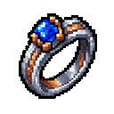
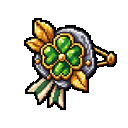
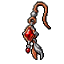
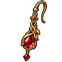
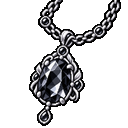
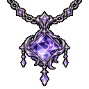
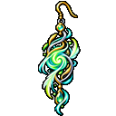
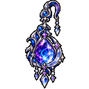

# 장신구 도감

장신구는 세공으로 제작하고 `/세공`에서 보관·장착합니다. 동시에 최대 2개를 장착할 수 있습니다. 아래 36종의 제작법과 효과는 2026년 9월 11일 확인 기준입니다.

모든 장신구 제작은 세공 해금이 필요하고, 현재 제작 시간은 5초·시설 물 소모는 60입니다. 아래 수치는 아직 최종 밸런스가 아니므로 게임 안 표시가 바뀌었다면 게임 화면을 우선하세요.

## 등급과 잠재능력 

장신구에는 고유 효과 외에 잠재능력 2줄이 붙습니다. 같은 잠재능력은 한 장신구 안에서 중복되지 않습니다. 제작한 장신구의 설명에서 등급과 잠재능력을 확인하세요.

잠재능력 후보에는 이동 속도, 블록 파괴 속도, 최대 체력, 상호작용 거리, 방어력, 공격력, 넉백 저항과 낙하 피해 감소가 포함됩니다. 실제 범위는 등급에 따라 달라집니다.

## 고유 효과 30종 

`공명의 인장`은 혼자서는 효과가 없지만, 함께 장착한 다른 장신구의 공명 대상 수치를 2배로 만듭니다. 모든 수치가 공명되는 것은 아니므로 아래 표의 설명을 확인하세요.

| 단계 | 장신구 | 현재 고유 효과 |
| --- | --- | --- |
| 입문 |  초심의 반지 | 현재 직업 Lv.50 이하일 때 직업 XP +5%; 공명 시 +10% |
| 입문 |  검소한 팔찌 | 내구도 소모를 5% 확률로 방지; 공명 시 10% |
| 입문 |  작은 행운의 브로치 | 적용 대상 수입마다 5% 확률로 수입 +25%; 공명 시 발동 확률 10% |
| 입문 |  바람결 귀걸이 | 지상에서 달리는 동안 이동 속도 +5%; 공명 시 +10% |
| 입문 |  인연의 목걸이 | 해당 주민의 하루 첫 호감도 상승 ×1.2; 공명 시 ×2.4 |
| 숙련 |  숙련의 반지 | 10초 안에 직업 XP를 연속 획득하면 회당 +1%, 최대 +5%; 공명 시 최대 +10% |
| 숙련 |  장인의 팔찌 | 실제 내구도 감소 9회마다 다음 1회 방지; 공명 시 다음 2회 방지 |
| 숙련 |  결실의 브로치 | 적용 대상 수입 20회마다 50G 추가; 공명 시 100G |
| 숙련 |  흐름의 귀걸이 | 달리기 2초 이상 +5%, 5초 이상 +10%; 공명 시 각각 +10% / +20% |
| 숙련 |  신뢰의 목걸이 | 해당 NPC의 하루 첫 상승 이후 호감도 상승마다 +10; 공명 시 +20 |
| 보석 |  홍옥 반지 | Active 성공 뒤 다음 직업 XP 10회 +10%; 공명 시 +20% |
| 보석 |  청옥 목걸이 | 직업 XP 20회마다 +100 XP; 공명 시 +200 XP |
| 보석 |  녹옥 팔찌 | 고품질 결과 확률 +3%p; 공명 시 +6%p |
| 보석 |  자옥 귀걸이 | 1번 Active 쿨타임 -5%; 공명 시 -10% |
| 보석 |  백옥 반지 | 음식·음료의 이로운 효과 지속 시간 +10%; 공명 시 +20% |
| 보석 |  흑옥 목걸이 | 내구도 20% 이하에서 소모를 20% 확률로 방지; 공명 시 40% |
| 정령 |  대지의 목걸이 | 광산 보상 20회마다 그 보상 수량 +5; 공명 시 +10 |
| 정령 |  물결의 팔찌 | 가공 결과의 무작위 선택지 +1; 공명 시 +2 |
| 정령 |  불꽃의 브로치 | 기술자 오버클럭 제작 속도에 +0.25배 추가; 공명 시 +0.5배 추가 |
| 정령 |  공명의 인장 | 함께 장착한 다른 장신구의 공명 대상 수치를 2배로 강화 |
| 탄생 |  一月 황혼 — 베스퍼 | 내구도 소모량 -20%; 공명 시 -40% |
| 탄생 |  二月 월광 — 루나리스 | 모든 직업 XP +10%; 공명 시 +20% |
| 탄생 |  三月 해류 — 네레이아 | 요리·음료 배치마다 10% 확률로 결과 +1; 공명 시 결과 +2 |
| 탄생 |  四月 광휘 — 루미나 | 광산 보상마다 5% 확률로 수량 +1; 공명 시 발동 확률 10% |
| 탄생 |  五月 신록 — 실바리스 | 심는 순간 커스텀 작물 성장 시간 -15%; 공명 시 -30% |
| 탄생 |  六月 월화 — 셀레네 | 장착 중 모든 NPC 호감도가 +25 높게 표시; 공명 시 +50, 실제 호감도는 변하지 않음 |
| 탄생 |  七月 작열 — 솔레아 | 기술대 제작 속도 +15%; 공명 시 +30% |
| 탄생 |  八月 화관 — 플로라 | 적용 대상 수입 +10%; 공명 시 +20% |
| 탄생 |  十月 환채 — 프리즈마 | 최종 품질 결정 때 5% 확률로 품질 1단계 상승; 공명 시 발동 확률 10% |
| 탄생 |  十一月 여명 — 솔리스 | 모든 Active 쿨타임 -15%; 공명 시 -30% |

적용 대상 수입에는 서버가 허용한 생산·보상 수입만 포함됩니다. 유저거래소, 송금, 에스크로 지급, 수표 환전과 캐시에는 수입 장신구 효과가 붙지 않습니다.

## 현재 고유 효과가 없는 6종 

아래 장신구는 제작하고 장착할 수 있으며 잠재능력도 적용됩니다. 다만 확인 날짜 기준으로 별도의 고유 효과는 없습니다.

- 황옥 브로치
- 청록 팔찌
- 순환의 반지
- 바람의 귀걸이
- 九月 창공 — 아주라
- 十二月 천궁 — 아스트라

## 입문·숙련 장신구 제작법 

| 장신구 | 재료 |
| --- | --- |
| 초심의 반지 | 기초 합금 3개, 압축 청금석 14개 |
| 검소한 팔찌 | 기초 합금 4개, 압축 철 8개 |
| 작은 행운의 브로치 | 기초 합금 2개, 압축 금 9개 |
| 바람결 귀걸이 | 기초 합금 2개, 압축 레드스톤 18개 |
| 인연의 목걸이 | 기초 합금 5개, 압축 에메랄드 2개 |
| 숙련의 반지 | 강화 합금 6개, 압축 청금석 56개 |
| 장인의 팔찌 | 강화 합금 8개, 압축 철 32개 |
| 결실의 브로치 | 강화 합금 4개, 압축 금 36개 |
| 흐름의 귀걸이 | 강화 합금 4개, 압축 레드스톤 72개 |
| 신뢰의 목걸이 | 강화 합금 10개, 압축 에메랄드 8개 |

## 보석 장신구 제작법 

| 장신구 | 재료 |
| --- | --- |
| 홍옥 반지 | 홍옥석 3개, 정밀 합금 6개, 압축 레드스톤 48개, 압축 금 12개 |
| 청옥 목걸이 | 청옥석 3개, 정밀 합금 6개, 압축 청금석 48개, 압축 철 12개 |
| 녹옥 팔찌 | 녹옥석 3개, 정밀 합금 6개, 압축 구리 36개, 압축 에메랄드 8개 |
|  황옥 브로치 | 황옥석 3개, 정밀 합금 6개, 압축 금 24개, 압축 레드스톤 24개 |
| 자옥 귀걸이 | 자옥석 3개, 정밀 합금 6개, 압축 레드스톤 24개, 압축 청금석 24개, 압축 금 8개 |
| 백옥 반지 | 백옥석 3개, 정밀 합금 6개, 압축 다이아몬드 16개 |
| 흑옥 목걸이 | 흑옥석 3개, 정밀 합금 6개, 압축 석탄 48개 |
|  청록 팔찌 | 청록석 3개, 정밀 합금 6개, 압축 구리 16개, 압축 청금석 16개, 압축 에메랄드 6개 |

## 정령 장신구 제작법 

| 장신구 | 재료 |
| --- | --- |
|  순환의 반지 | 순환의 정령석 4개, 고밀도 합금 6개, 녹옥석 2개, 압축 에메랄드 24개, 압축 석탄 72개 |
| 대지의 목걸이 | 대지의 정령석 4개, 고밀도 합금 6개, 흑옥석 2개, 압축 철 64개, 압축 금 40개 |
| 물결의 팔찌 | 물의 정령석 4개, 고밀도 합금 6개, 청록석 2개, 압축 청금석 96개, 압축 다이아몬드 20개 |
| 불꽃의 브로치 | 불의 정령석 4개, 고밀도 합금 6개, 홍옥석 2개, 압축 레드스톤 96개, 압축 금 64개 |
|  바람의 귀걸이 | 바람의 정령석 4개, 고밀도 합금 6개, 청옥석 2개, 압축 청금석 80개, 압축 철 64개 |
| 공명의 인장 | 공명의 정령석 4개, 고밀도 합금 6개, 백옥석 1개, 청록석 1개, 압축 다이아몬드 22개, 압축 에메랄드 22개 |

## 탄생 장신구 제작법 

| 월 | 장신구 | 재료 |
| ---: | --- | --- |
| 1월 | 一月 황혼 — 베스퍼 | 베스퍼 4개, 고밀도 합금 12개, 자옥석 4개, 압축 금 64개, 압축 다이아몬드 64개 |
| 2월 | 二月 월광 — 루나리스 | 루나리스 4개, 고밀도 합금 12개, 백옥석 3개, 압축 다이아몬드 64개, 압축 청금석 96개 |
| 3월 | 三月 해류 — 네레이아 | 네레이아 4개, 고밀도 합금 12개, 청록석 3개, 압축 청금석 176개, 압축 구리 176개 |
| 4월 | 四月 광휘 — 루미나 | 루미나 4개, 고밀도 합금 12개, 백옥석 3개, 압축 금 80개, 압축 다이아몬드 40개 |
| 5월 | 五月 신록 — 실바리스 | 실바리스 4개, 고밀도 합금 12개, 녹옥석 3개, 압축 에메랄드 64개, 압축 구리 96개 |
| 6월 | 六月 월화 — 셀레네 | 셀레네 4개, 고밀도 합금 12개, 백옥석 3개, 압축 다이아몬드 48개, 압축 에메랄드 40개 |
| 7월 | 七月 작열 — 솔레아 | 솔레아 4개, 고밀도 합금 12개, 홍옥석 4개, 압축 레드스톤 128개, 압축 금 48개 |
| 8월 | 八月 화관 — 플로라 | 플로라 4개, 고밀도 합금 12개, 녹옥석 4개, 압축 에메랄드 64개, 압축 금 56개 |
| 9월 |  九月 창공 — 아주라 | 아주라 4개, 고밀도 합금 12개, 청옥석 3개, 압축 청금석 160개, 압축 다이아몬드 48개 |
| 10월 | 十月 환채 — 프리즈마 | 프리즈마 4개, 고밀도 합금 12개, 자옥석 2개, 압축 다이아몬드 48개, 압축 에메랄드 36개 |
| 11월 | 十一月 여명 — 솔리스 | 솔리스 4개, 고밀도 합금 12개, 황옥석 4개, 압축 금 72개, 압축 레드스톤 96개 |
| 12월 |  十二月 천궁 — 아스트라 | 아스트라 4개, 고밀도 합금 12개, 자옥석 4개, 압축 다이아몬드 64개, 압축 청금석 128개 |

관련 문서: [보석·정령석 도감](gems.md) · [광물·제련 도감](minerals-and-smelting.md) · [가공](../world/processing.md)
