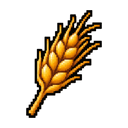
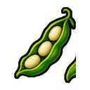
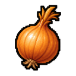
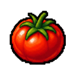
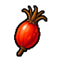

# 작물 도감

MineValley에는 일반 작물 14종과 허브 8종, 총 22종의 재배 작물이 있습니다. 각 작물에는 일반 씨앗·수확물·대형 씨앗·대형 수확물 네 가지 아이템이 있어 작물 계열 아이템은 모두 88종입니다.

## 현재 재배 기준

2026년 9월 11일 LIVE 운영값입니다. 여기서 `성장일`은 물이 공급된 게임 안의 날짜만 셉니다.

| 분류 | 기본 성장 | 전문 해금 |
| --- | --- | --- |
| 일반 작물 | 물을 준 3일 | 기본 농사에서 재배 |
| 허브 | 물을 준 5일 | 농부 20레벨 전문 해금 |
| 대형 작물 | 물을 준 8일 | 농부 50레벨 전문 해금·전용 씨앗 필요 |

일반 씨앗으로는 대형 작물이 되지 않습니다. 대형 작물은 별도의 씨앗과 수확물 정체성을 가지며, 모든 작물은 현재 일반·상급·최상급의 세 품질로 수확될 수 있습니다.

## 일반 작물

| 작물 | 현재 확인된 가공 사용처 |
| --- | --- |
|  보리 | 보리 커피, 황금 곡물 커피, 황금 수확제 커피, 맥주, 보리죽 |
|  콩 | 콩 스튜 |
|  블루베리 | 블루베리 에이드, 오색 과일에이드, 달빛 정원차, 문라이트 티, 블루베리잼, 믹스베리 타르트, 블루베리 머핀 |
|  양배추 | 양배추 고기말이, 코울슬로 |
|  옥수수 | 황금 곡물 커피, 황금 수확제 커피, 치킨파이, 믹스드 그릴, 피자, 옥수수 수프 |
|  오이 | 가든 블렌드, 한여름 청량수, 민트 블렌드, 민트 아이스티, 오이피클, 치킨버거, 오이 샐러드 |
|  마늘 | 오이피클, 양고기 꼬치구이, 토마토 스파게티 |
|  포도 | 오색 과일에이드, 포도 에이드, 자스민 로즈 티, 레드 블렌드, 석양빛 과일 화채, 와인 |
|  상추 | 치킨버거, 햄버거, 오이 샐러드 |
|  올리브 | 피자 |
|  양파 | 비프 부르기뇽, 양배추 고기말이, 햄버거, 양고기 꼬치구이, 미트파이, 피자, 콩 스튜, 오이 샐러드, 양파 수프, 토마토 스파게티 |
|  무 | 현재 직접 가공 레시피 없음 |
|  딸기 | 오색 과일에이드, 딸기 에이드, 석양빛 과일 화채, 딸기잼, 믹스베리 타르트 |
|  토마토 | 햄버거, 피자, 토마토 스파게티 |

## 허브

| 허브 | 현재 확인된 가공 사용처 |
| --- | --- |
|  캐모마일 | 캐모마일 티 |
|  히비스커스 | 히비스커스 티 |
|  자스민 | 플라워 블렌드, 자스민 티, 달빛 정원차 |
|  라벤더 | 플라워 블렌드, 라벤더 티, 달빛 정원차, 문라이트 티 |
|  레몬그라스 | 레몬그라스 티, 민트 블렌드 |
|  페퍼민트 | 한여름 청량수, 페퍼민트 티 |
|  로즈힙 | 자스민 로즈 티, 레드 블렌드, 로즈힙 티, 석양빛 과일 화채 |
|  로즈마리 | 로즈마리 티 |

표의 사용처는 작물을 재료로 직접 요구하는 가공 레시피입니다. 판매, 주문, 주민 퀘스트와 섬 납품처럼 제작 이외의 사용처는 별도로 존재할 수 있습니다.

## 씨앗을 구하는 곳

일반 작물 씨앗과 허브 씨앗은 서로 다른 상점에서 다룹니다. 상점에서 씨앗 이름과 요구 조건을 확인하고, 대형 작물은 전용 씨앗인지 다시 확인하세요.

## 품질과 가공

작물 품질은 가공 결과를 그대로 확정하지 않고 결과 품질의 확률에 영향을 줍니다. 품질이 없는 일반 재료는 이 계산에서 중립으로 처리됩니다. 정확한 확률은 현재 가공 도감과 아이템 설명을 기준으로 확인하세요.

관련 문서: [농사](../world/farming.md) · [가공](../world/processing.md) · [농부](../jobs/farmer.md)
