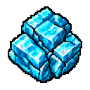
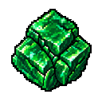
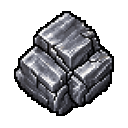
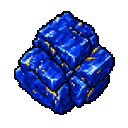

# 광물·제련 도감

캔 광물을 압축하거나 합금·판재로 가공하면 보석과 기술 제품의 재료로 쓸 수 있습니다. 아래 제작법은 2026년 9월 11일 확인 기준입니다.

## 채광 산출물 

무한광산에서는 등급에 따라 돌, 석탄, 철, 금과 다이아몬드를 캘 수 있습니다. 온라인 잠광에서는 레드스톤, 청금석, 에메랄드를 포함한 8종의 재료를 얻습니다.

직접 캔 아이템은 플레이어가 획득하고 잠광 결과는 광물창고로 정산됩니다. 철과 금의 원석은 다음 가공에 사용하기 전에 주괴로 제련해야 합니다.

## 압축 광물 8종 

압축 광물은 같은 일반 광물 3개를 가공해 1개로 만듭니다. 각 제작은 현재 5초와 시설 물 50을 사용하며, 결과물은 고정된 일반 품질입니다.

| 결과물 | 재료 |
| --- | --- |
|  압축 석탄 | 석탄 3개 |
|  압축 구리 | 구리 주괴 3개 |
|  압축 다이아몬드 | 다이아몬드 3개 |
|  압축 에메랄드 | 에메랄드 3개 |
|  압축 금 | 금 주괴 3개 |
|  압축 철 | 철 주괴 3개 |
|  압축 청금석 | 청금석 3개 |
|  압축 레드스톤 | 레드스톤 3개 |

## 합금 4종 

합금 제작은 현재 시설 물 20을 사용합니다.

| 결과물 | 재료 | 시간 |
| --- | --- | ---: |
| 기초 합금 1개 | 압축 구리 2개, 철 주괴 2개 | 15초 |
| 강화 합금 1개 | 압축 철 2개, 압축 금 1개, 압축 구리 1개 | 20초 |
| 정밀 합금 1개 | 압축 금 3개, 압축 청금석 6개, 압축 구리 6개 | 30초 |
| 고밀도 합금 1개 | 네더라이트 주괴 2개, 압축 다이아몬드 3개, 압축 에메랄드 3개 | 45초 |

## 판재 4종 

판재는 합금과 건축 재료를 가공해 한 번에 2개가 완성됩니다. 각 제작은 현재 시설 물 50을 사용합니다.

| 결과물 | 재료 | 시간 |
| --- | --- | ---: |
| 기초 판재 2개 | 기초 합금 1개, 조약돌 8개 | 5초 |
| 강화 판재 2개 | 강화 합금 1개, 조약돌 12개 | 10초 |
| 정밀 판재 2개 | 정밀 합금 1개, 조약돌 8개, 구리 주괴 2개 | 15초 |
| 고밀도 판재 2개 | 고밀도 합금 1개, 조약돌 16개, 철 주괴 4개 | 20초 |

## 자석 

자석은 철 주괴 2개와 레드스톤 4개를 가공하는 기술 중간재입니다. 자동줍기와 감지 설비 계열의 후속 제작에 사용됩니다.

## 제련품의 특징 

- 압축품·합금·판재와 보석은 품질 추첨 없이 고정 품질로 완성됩니다.
- 기본 제련은 특정 직업만의 활동이 아닙니다.
- 완성된 합금과 판재는 기술 부품, 설비와 더 높은 단계의 재료로 이어집니다.
- 보석 제작에 필요한 압축 광물 수량은 [보석·정령석 도감](gems.md)에서 확인할 수 있습니다.

관련 문서: [광산과 잠광](../world/mining.md) · [가공](../world/processing.md) · [기술 설비](../world/technology.md)
