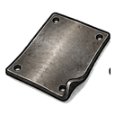
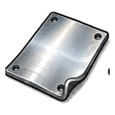
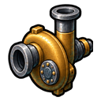
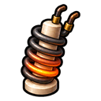
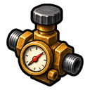

# 기술 재료·부품 도감

기술 제작은 가공사가 만든 합금·판재를 금속판과 기계 부품으로 바꾸고, 그 부품을 다시 설비와 완제품으로 조립하는 다단계 생산입니다. 이 페이지는 2026년 9월 11일 LIVE 운영본의 기술 중간재 27종과 제작식 27종을 모두 정리합니다.

현재 중간재에는 직업·레벨 제한이 없으며 모든 기술대에서 만들 수 있습니다. 조립을 시작할 때 표시된 제작 시간만큼 기술대 연료가 필요합니다.

## 금속판 4종

가공사의 `판재`와 기술자의 `금속판`은 서로 다른 재료입니다. 이름을 혼동하지 않도록 재료 칸을 다시 확인하세요.

| 금속판 | 재료 | 시간 |
| --- | --- | ---: |
|  기초 금속판 | 기초 합금 2개 | 30초 |
|  강화 금속판 | 강화 합금 2개 | 30초 |
|  정밀 금속판 | 정밀 합금 2개 | 30초 |
|  고밀도 금속판 | 고밀도 합금 2개 | 30초 |

## 기본·기계 부품 16종

| 부품 | 재료 | 시간 |
| --- | --- | ---: |
|  전기선 | 금 주괴 1개, 레드스톤 4개 | 30초 |
|  기계 부품 | 기초 합금 2개 | 30초 |
|  펌프 | 기계 부품 4개, 기초 금속판 2개, 기초 판재 2개 | 60초 |
|  분사 노즐 | 기계 부품 4개, 기초 금속판 2개, 기초 판재 2개 | 60초 |
|  밀폐 용기 | 기계 부품 4개, 기초 금속판 2개, 강화 판재 2개 | 60초 |
|  회로 기판 | 전기선 8개, 정밀 금속판 1개 | 60초 |
|  가열 코일 | 전기선 8개, 정밀 금속판 1개 | 60초 |
|  모터 | 기계 부품 4개, 전기선 4개, 강화 금속판 1개 | 60초 |
|  센서 | 기계 부품 4개, 전기선 4개, 강화 금속판 1개 | 60초 |
|  토양 탐침 | 기계 부품 4개, 전기선 4개, 정밀 금속판 1개 | 60초 |
|  분류 필터 | 기계 부품 4개, 전기선 4개, 정밀 금속판 1개 | 60초 |
|  열교환기 | 기계 부품 4개, 전기선 4개, 정밀 금속판 1개, 강화 판재 2개 | 60초 |
|  변속기 | 기계 부품 8개, 강화 금속판 1개 | 60초 |
|  조절기 | 기계 부품 8개, 전기선 4개 | 60초 |
|  급수 밸브 | 기계 부품 8개, 강화 금속판 1개, 강화 판재 1개 | 60초 |
|  압축 실린더 | 기계 부품 8개, 강화 금속판 1개, 고밀도 판재 1개 | 60초 |

## 상위 부품 4종

| 부품 | 재료 | 시간 |
| --- | --- | ---: |
|  압력 탱크 | 기계 부품 4개, 강화 금속판 2개, 고밀도 판재 1개 | 60초 |
|  고밀도 부품 | 고밀도 합금 4개, 고밀도 금속판 2개, 고밀도 판재 2개, 기계 부품 4개 | 120초 |
| 전력 릴레이 | 회로 기판 2개, 조절기 2개, 전기선 8개, 강화 금속판 2개 | 120초 |
|  마도 코어 | 마도 코어 외피 1개, 마도 제어 장치 1개, 마력 응축기 1개, 고밀도 부품 12개, 네더라이트 파편 8개 | 30분 |

## 마도공학 부품 3종

| 부품 | 역할 | 재료 | 시간 |
| --- | --- | --- | ---: |
|  마도 코어 외피 | 코어 구조와 열 안정성 유지 | 고밀도 부품 12개, 고밀도 금속판 8개, 열교환기 4개 | 10분 |
|  마도 제어 장치 | 마력 흐름 감지와 제어 | 회로 기판 8개, 조절기 8개, 센서 4개, 전기선 16개 | 10분 |
|  마력 응축기 | 마력 응축과 보존 | 압력 탱크 4개, 압축 실린더 4개, 고밀도 부품 8개, 네더라이트 파편 8개 | 10분 |

## 주요 사용처

| 부품 묶음 | 주로 이어지는 제품 |
| --- | --- |
| 펌프·분사 노즐·급수 밸브·토양 탐침 | 스프링클러와 농산물 창고 |
| 센서·모터·변속기·조절기 | 허수아비, 재배 알리미와 상위 자동화 설비 |
| 밀폐 용기·분류 필터 | 농산물·광물 창고와 재료통 |
| 가열 코일·열교환기·압력 탱크 | 고성능 화로와 증기 설비 |
| 회로 기판·전력 릴레이 | 전기 기술대와 마도공학 제작 |
| 마도 코어 3부품·고밀도 부품 | 마도 코어와 마도공학 기술대 |

관련 문서: [광물·제련 도감](minerals-and-smelting.md) · [기술 설비 도감](technical-facilities.md) · [기술 완제품 도감](technical-products.md)
