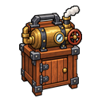
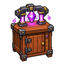

# 기술대·기반 설비 도감

기술대에서는 부품과 설비를 조립합니다. 레일·재료통·연료통을 설치하면 여러 기술대에 재료와 연료를 공급할 수 있습니다. 아래 수치는 2026년 9월 11일 확인 기준입니다.

## 기술대 4종 

기술대 제작식 자체에는 직업 제한이 없지만, 상위 기술대를 설치할 때는 설치자의 주직업과 기술자 레벨을 검사합니다. 기술대는 완성품 수량만큼 내구도를 소모하며, 내구도가 0이 된 작업은 정상 완료되고 다음 작업부터 수리 전까지 시작할 수 없습니다.

| 기술대 | 설치 조건 | 현재 최대 내구도 | 제작 재료 | 시간 |
| --- | --- | ---: | --- | ---: |
|  일반 기술대 | 제한 없음 | 500 | 기초 판재 8개, 기초 금속판 4개, 기계 부품 8개 | 5초 |
|  증기 기술대 | 주직업 기술자 Lv.20 이상 | 800 | 펌프 2개, 압력 탱크 1개, 강화 금속판 1개, 강화 판재 4개 | 5초 |
|  전기 기술대 | 주직업 기술자 Lv.50 이상 | 1,200 | 전력 릴레이 1개, 모터 1개, 정밀 금속판 2개, 정밀 판재 8개 | 15분 |
|  마도공학 기술대 | 주직업 기술자 Lv.80 이상 | 1,600 | 마도 코어 1개, 고밀도 부품 8개, 고밀도 금속판 16개, 고밀도 판재 16개 | 5초 |

증기 기술대는 앞선 제작 공정을 최대 2개까지 함께 처리합니다.


2026년 9월 11일 확인 당시, 마도공학 기술대의 속성별 추가 성능은 아직 사용할 수 없습니다. 제작·설치 조건과 추가 성능의 이용 가능 여부는 구분해서 확인하세요.


## 기술대 연료 

기술대는 연료를 초 단위 가동 시간으로 저장합니다. 현재 한 기술대의 최대 연료는 1,800초입니다.

| 연료 | 충전 시간 |
| --- | ---: |
| 석탄·목탄 | 개당 80초 |
| 석탄 블록 | 개당 720초 |
| 원목 계열 | 개당 20초 |
| 판자 계열 | 개당 10초 |

막대기, 용암 양동이, 블레이즈 막대와 말린 켈프 등 표에 없는 연료는 현재 기술대 연료로 받지 않습니다.

## 생산 라인 기반 설비 3종 

| 설비 | 역할 | 제작 재료 | 시간 |
| --- | --- | --- | ---: |
|  레일 | 바라보는 방향을 기준으로 기술대 사이에 물건을 전달 | 기계 부품 4개, 기초 금속판 4개, 기초 판재 8개 | 60초 |
|  재료통 | 레일의 하류 기술대에 제작 재료 공급 | 밀폐 용기 4개, 분류 필터 2개, 강화 금속판 4개, 강화 판재 4개 | 3분 |
|  연료통 | 레일의 하류 기술대에 연료 공급 | 밀폐 용기 2개, 압력 탱크 2개, 펌프 2개, 강화 금속판 4개, 강화 판재 4개 | 3분 |

현재 기본 운용값은 재료통 512개, 연료통 3,600초입니다. 한 번의 공급 처리에서는 재료 최대 32개, 연료 최대 300초가 하류로 이동합니다.

## 설치와 확인 

1. 설치할 블록 면을 바라보고 설비 아이템을 우클릭합니다.
2. 레일이 보내는 방향과 재료통·연료통의 하류 기술대를 맞춥니다.
3. `/라인` 또는 `/기술자라인`으로 바라보는 기술대의 연결을 확인합니다.
4. 기술대 화면에서 목표 제품, 재료, 연료, 내구도와 완료품 수령 상태를 확인합니다.

관련 문서: [기술 재료·부품 도감](technical-components.md) · [기술 완제품 도감](technical-products.md) · [기술 설비](../world/technology.md)
