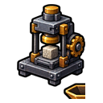

# 기술 완제품 도감

조립대에서 만드는 기술 완제품 38종의 재료와 사용법입니다. 수치는 2026년 9월 11일 확인 기준입니다.

플레이어 1명이 설치할 수 있는 기술 장비는 현재 최대 64대입니다. 제작 시간과 성능 수치는 아직 조정될 수 있으므로 실제 설치 전 게임 안 설명도 함께 확인하세요.

## 기능 한눈에 보기 

| 제품군 | 현재 기능 |
| --- | --- |
| 자동 파종기 I~IV | 바닐라 작물 자동심기 200 / 600 / 1,800 / 5,000회 충전 |
| 자동 수거기 I~IV | 직접 캔·부순 드롭 자동줍기 200 / 600 / 1,800 / 5,000회 충전 |
| 자동 제작대 I~IV | 입력 용량 256 / 512 / 1,024 / 2,304, 자동 제작 숙련도는 수동의 30% |
| 고성능 화로 I~IV | 여러 입력을 더 빠르고 효율적으로 제련하는 설치형 장비 |
| 농산물 창고 I~IV | 수확물 자동 적립 용량을 순서대로 확장하는 모듈 |
| 광물 창고 I~IV | 잠광 산출물의 총량·재질별 상한을 순서대로 확장하는 모듈 |
| 스프링클러 I~IV | 반경 1 / 2 / 3 / 4칸의 농지를 주기적으로 급수 |
| 재배 알리미 I~IV | 등록 구역의 작물 상태 확인 범위와 구역 수 확장 |
| 허수아비 I~IV | 반경 8칸의 농지를 보호·관리하는 설치형 장비 |
|  자동 블록 압축기 | 허용된 바닐라 재료를 9개당 블록 1개로 자동 압축 |
|  상자 정리 장치 | 일반 상자와 덫 상자의 내용물을 정리 |

자동 파종기와 자동 수거기는 아이템을 사용해 이용 횟수를 충전합니다. 자세한 사용법은 아래 제작표에서 확인하세요.

## 농산물·광물 창고 성능 

농산물 창고의 기본 용량은 2,304개입니다. 각 모듈은 I부터 순서대로 한 번씩 적용하며, 현재 단계의 보너스로 교체됩니다.

| 단계 | 농산물 창고 총용량 | 광물 창고 총량 상한 | 광물 재질별 상한 |
| ---: | ---: | ---: | ---: |
| 기본 | 2,304 | 500,000 | 100,000 |
| I | 4,608 | 1,000,000 | 200,000 |
| II | 6,912 | 2,000,000 | 400,000 |
| III | 11,520 | 4,500,000 | 900,000 |
| IV | 20,736 | 10,500,000 | 2,100,000 |

## 농업 설비 성능 

| 단계 | 스프링클러 반경 | 물 용량 | 회당 물 소모 | 내구도 | 재배 알리미 최대 면적·구역 |
| ---: | ---: | ---: | ---: | ---: | --- |
| I | 1칸 | 256 | 4 | 200 | 64블록·1구역 |
| II | 2칸 | 512 | 3 | 400 | 256블록·2구역 |
| III | 3칸 | 1,024 | 2 | 800 | 1,024블록·3구역 |
| IV | 4칸 | 2,048 | 1 | 1,600 | 4,096블록·5구역 |

스프링클러는 10초마다 작동합니다. 허수아비는 단계와 관계없이 반경 8칸을 관리하며, 플레이어당 최대 4대를 설치할 수 있습니다.

## 생산 설비 성능 

| 단계 | 고성능 화로 입력 종류 | 입·출력 용량 | 아이템당 시간 | 연료 효율 | 자동 제작대 입력 용량 | 내구도 |
| ---: | ---: | ---: | ---: | ---: | ---: | ---: |
| I | 2종 | 128 / 128 | 5초 | 100% | 256 | 200 |
| II | 3종 | 256 / 256 | 3.5초 | 130% | 512 | 400 |
| III | 4종 | 512 / 512 | 2.25초 | 160% | 1,024 | 800 |
| IV | 6종 | 1,024 / 1,024 | 1.25초 | 200% | 2,304 | 1,600 |

## 자동 파종기·수거기 제작법 

| 제품 | 재료 | 시간 |
| --- | --- | ---: |
| 자동 파종기 I | 기초 금속판 2개, 기계 부품 2개, 전기선 1개 | 5초 |
| 자동 파종기 II | 강화 금속판 2개, 기계 부품 2개, 전기선 1개 | 7초 |
| 자동 파종기 III | 정밀 금속판 2개, 기계 부품 2개, 전기선 1개 | 10초 |
| 자동 파종기 IV | 고밀도 금속판 2개, 기계 부품 2개, 전기선 1개 | 14초 |
| 자동 수거기 I | 기초 금속판 2개, 기계 부품 2개, 전기선 1개 | 5초 |
| 자동 수거기 II | 강화 금속판 2개, 기계 부품 2개, 전기선 1개 | 7초 |
| 자동 수거기 III | 정밀 금속판 2개, 기계 부품 2개, 전기선 1개 | 10초 |
| 자동 수거기 IV | 고밀도 금속판 2개, 기계 부품 2개, 전기선 1개 | 14초 |

I~IV의 제작 요구 레벨은 각각 Lv.1, Lv.3, Lv.5, Lv.8입니다. 제품 1개를 우클릭하면 해당 단계의 충전 횟수가 적립되고 아이템은 소비됩니다.

## 자동 제작대 제작법 

| 제품 | 재료 | 시간 |
| --- | --- | ---: |
|  자동 제작대 I | 기초 판재 4개, 기초 금속판 2개, 기계 부품 4개, 전기선 3개 | 5초 |
|  자동 제작대 II | 강화 판재 4개, 강화 금속판 2개, 기계 부품 4개, 전기선 3개 | 7초 |
|  자동 제작대 III | 정밀 판재 4개, 정밀 금속판 2개, 기계 부품 4개, 전기선 3개 | 10초 |
|  자동 제작대 IV | 고밀도 판재 4개, 고밀도 금속판 2개, 기계 부품 4개, 전기선 3개 | 14초 |

I~IV의 제작 요구 레벨은 각각 Lv.1, Lv.3, Lv.5, Lv.8입니다.

## 농산물 창고 제작법 

| 제품 | 재료 | 시간 |
| --- | --- | ---: |
|  농산물 창고 I | 밀폐 용기 4개, 기초 판재 8개, 기초 금속판 4개, 기계 부품 8개 | 3분 |
|  농산물 창고 II | 밀폐 용기 8개, 분류 필터 4개, 급수 밸브 2개, 강화 판재 12개, 강화 금속판 8개, 기계 부품 16개 | 5분 |
|  농산물 창고 III | 밀폐 용기 12개, 분류 필터 8개, 급수 밸브 4개, 센서 4개, 가열 코일 4개, 열교환기 4개, 정밀 판재 16개, 정밀 금속판 12개 | 10분 |
|  농산물 창고 IV | 밀폐 용기 16개, 분류 필터 12개, 급수 밸브 8개, 센서 8개, 가열 코일 8개, 열교환기 8개, 조절기 8개, 고밀도 부품 16개, 고밀도 판재 24개, 고밀도 금속판 24개 | 20분 |

## 광물 창고 제작법 

| 제품 | 재료 | 시간 |
| --- | --- | ---: |
|  광물 창고 I | 밀폐 용기 4개, 기초 판재 8개, 기초 금속판 4개, 기계 부품 8개 | 3분 |
|  광물 창고 II | 밀폐 용기 8개, 분류 필터 4개, 모터 2개, 강화 판재 12개, 강화 금속판 8개, 기계 부품 16개 | 5분 |
|  광물 창고 III | 밀폐 용기 12개, 분류 필터 8개, 압력 탱크 4개, 센서 4개, 모터 4개, 변속기 4개, 정밀 판재 16개, 정밀 금속판 12개 | 10분 |
|  광물 창고 IV | 밀폐 용기 16개, 분류 필터 12개, 압력 탱크 8개, 센서 8개, 모터 8개, 변속기 8개, 조절기 8개, 고밀도 부품 16개, 고밀도 판재 24개, 고밀도 금속판 24개 | 20분 |

## 스프링클러 제작법 

| 제품 | 재료 | 시간 |
| --- | --- | ---: |
|  스프링클러 I | 분사 노즐 2개, 펌프 2개, 기초 판재 8개, 기초 금속판 4개, 기계 부품 8개 | 3분 |
|  스프링클러 II | 분사 노즐 4개, 펌프 4개, 토양 탐침 4개, 급수 밸브 2개, 강화 판재 12개, 강화 금속판 8개, 기계 부품 16개 | 5분 |
|  스프링클러 III | 분사 노즐 6개, 펌프 6개, 토양 탐침 8개, 급수 밸브 4개, 센서 4개, 가열 코일 4개, 열교환기 4개, 정밀 판재 16개, 정밀 금속판 12개 | 10분 |
|  스프링클러 IV | 분사 노즐 8개, 펌프 8개, 토양 탐침 12개, 급수 밸브 8개, 센서 8개, 가열 코일 8개, 열교환기 8개, 조절기 8개, 고밀도 부품 16개, 고밀도 판재 24개, 고밀도 금속판 24개 | 20분 |

## 재배 알리미 제작법 

| 제품 | 재료 | 시간 |
| --- | --- | ---: |
| 재배 알리미 I | 토양 탐침 2개, 센서 2개, 기초 판재 8개, 기초 금속판 4개, 기계 부품 8개 | 3분 |
| 재배 알리미 II | 토양 탐침 6개, 센서 4개, 회로 기판 2개, 조절기 2개, 강화 판재 12개, 강화 금속판 8개, 기계 부품 16개 | 5분 |
| 재배 알리미 III | 토양 탐침 12개, 센서 8개, 회로 기판 8개, 조절기 8개, 정밀 판재 16개, 정밀 금속판 12개 | 10분 |
| 재배 알리미 IV | 토양 탐침 16개, 센서 12개, 회로 기판 12개, 조절기 12개, 분류 필터 8개, 모터 8개, 고밀도 부품 16개, 고밀도 판재 24개, 고밀도 금속판 24개 | 20분 |

## 허수아비 제작법 

| 제품 | 재료 | 시간 |
| --- | --- | ---: |
|  허수아비 I | 센서 2개, 모터 2개, 기초 판재 8개, 기초 금속판 4개, 기계 부품 8개 | 3분 |
|  허수아비 II | 센서 4개, 모터 4개, 변속기 2개, 분사 노즐 4개, 강화 판재 12개, 강화 금속판 8개, 기계 부품 16개 | 5분 |
|  허수아비 III | 센서 8개, 모터 8개, 변속기 4개, 분사 노즐 8개, 조절기 4개, 토양 탐침 4개, 정밀 판재 16개, 정밀 금속판 12개 | 10분 |
|  허수아비 IV | 센서 12개, 모터 12개, 변속기 8개, 분사 노즐 12개, 조절기 8개, 토양 탐침 8개, 분류 필터 8개, 고밀도 부품 16개, 고밀도 판재 24개, 고밀도 금속판 24개 | 20분 |

## 고성능 화로 제작법 

| 제품 | 재료 | 시간 |
| --- | --- | ---: |
|  고성능 화로 I | 가열 코일 2개, 열교환기 2개, 기초 판재 8개, 기초 금속판 4개, 기계 부품 8개 | 3분 |
|  고성능 화로 II | 가열 코일 6개, 열교환기 4개, 펌프 4개, 강화 판재 12개, 강화 금속판 8개, 기계 부품 16개 | 5분 |
|  고성능 화로 III | 가열 코일 12개, 열교환기 8개, 펌프 4개, 압력 탱크 4개, 센서 4개, 조절기 4개, 정밀 판재 16개, 정밀 금속판 12개 | 10분 |
|  고성능 화로 IV | 가열 코일 16개, 열교환기 12개, 펌프 8개, 압력 탱크 8개, 센서 8개, 모터 8개, 조절기 8개, 고밀도 부품 16개, 고밀도 판재 24개, 고밀도 금속판 24개 | 20분 |

## 단일 편의 설비 제작법 

| 제품 | 재료 | 시간 | 현재 기능 |
| --- | --- | ---: | --- |
| 상자 정리 장치 | 기초 금속판 2개, 기계 부품 2개, 전기선 2개 | 5초 | 일반 상자·덫 상자 정리, 내구도 200 |
| 자동 블록 압축기 | 강화 판재 2개, 강화 금속판 2개, 기계 부품 3개, 전기선 2개 | 7초 | 내구도 200, 허용 품목 14종을 9:1 압축 |

자동 블록 압축기의 허용 품목은 철·금·다이아몬드·에메랄드·레드스톤·청금석·석탄·구리 주괴, 철·금·구리 원석, 네더라이트 주괴, 밀과 슬라임볼입니다.

## 향상 등급 

일부 설치형 완제품에는 제작 시 `향상 I·II·III`이 붙을 수 있습니다. 향상된 성능은 완성된 아이템의 설명에서 확인하세요. 다음 단계 제품의 기본 성능을 넘지는 않습니다.

현재 대상은 스프링클러 I~III, 자동 제작대 I~III, 고성능 화로 I~III, 허수아비 I~III, 상자 정리 장치와 자동 블록 압축기입니다. IV 제품, 창고·알리미 모듈, 충전형 제품과 기반 설비에는 향상 등급이 붙지 않습니다.

관련 문서: [기술 재료·부품 도감](technical-components.md) · [기술대·기반 설비 도감](technical-facilities.md) · [기술자](../jobs/technician.md)
