# 그림으로 찾는 전체 도감

작물·음식·제련·보석·장신구·기술 계열 292종을 그림과 이름으로 찾아보세요. 아이템 이름을 누르면 해당 제작법과 사용처 안내로 이동합니다.

이름은 위키 검색이나 브라우저의 페이지 내 찾기로 검색할 수 있습니다. 그림이 없는 아이템은 이름을 눌러 확인하세요.

## 작물과 씨앗 88종

| 아이템                                                                                                                                                        | 아이템                                                                                                                                             |
| ---------------------------------------------------------------------------------------------------------------------------------------------------------- | ----------------------------------------------------------------------------------------------------------------------------------------------- |
| 
 <a href="crops.md">보리</a>
                                  | 
<a href="crops.md">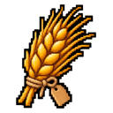</a> <a href="crops.md">거대 보리</a>
           |
| 
 <a href="crops.md">거대 보리 씨앗</a>
           | 
<a href="crops.md">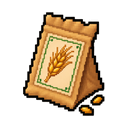</a> <a href="crops.md">보리 씨앗</a>
            |
| 
 <a href="crops.md">콩</a>
                                      | 
<a href="crops.md">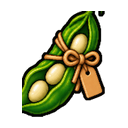</a> <a href="crops.md">거대 콩</a>
               |
| 
 <a href="crops.md">거대 콩 씨앗</a>
               | 
 <a href="crops.md">콩 씨앗</a>
                |
| 
<a href="crops.md">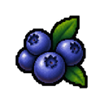</a> <a href="crops.md">블루베리</a>
                           | 
 <a href="crops.md">거대 블루베리</a>
    |
| 
 <a href="crops.md">거대 블루베리 씨앗</a>
    | 
 <a href="crops.md">블루베리 씨앗</a>
     |
| 
 <a href="crops.md">양배추</a>
                               | 
 <a href="crops.md">거대 양배추</a>
        |
| 
 <a href="crops.md">거대 양배추 씨앗</a>
        | 
 <a href="crops.md">양배추 씨앗</a>
         |
| 
 <a href="crops.md">캐모마일</a>
                           | 
 <a href="crops.md">거대 캐모마일</a>
    |
| 
 <a href="crops.md">거대 캐모마일 씨앗</a>
    | 
 <a href="crops.md">캐모마일 씨앗</a>
     |
| 
 <a href="crops.md">옥수수</a>
                                  | 
 <a href="crops.md">거대 옥수수</a>
           |
| 
 <a href="crops.md">거대 옥수수 씨앗</a>
           | 
<a href="crops.md">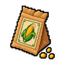</a> <a href="crops.md">옥수수 씨앗</a>
            |
| 
 <a href="crops.md">오이</a>
                                | 
 <a href="crops.md">거대 오이</a>
         |
| 
 <a href="crops.md">거대 오이 씨앗</a>
         | 
<a href="crops.md">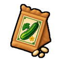</a> <a href="crops.md">오이 씨앗</a>
          |
| 
<a href="crops.md">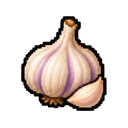</a> <a href="crops.md">마늘</a>
                                  | 
 <a href="crops.md">거대 마늘</a>
           |
| 
 <a href="crops.md">거대 마늘 씨앗</a>
           | 
<a href="crops.md">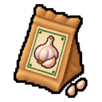</a> <a href="crops.md">마늘 씨앗</a>
            |
| 
 <a href="crops.md">포도</a>
                                   | 
 <a href="crops.md">거대 포도</a>
            |
| 
 <a href="crops.md">거대 포도 씨앗</a>
            | 
 <a href="crops.md">포도 씨앗</a>
             |
| 
 <a href="crops.md">히비스커스</a>
                          | 
 <a href="crops.md">거대 히비스커스</a>
   |
| 
 <a href="crops.md">거대 히비스커스 씨앗</a>
   | 
 <a href="crops.md">히비스커스 씨앗</a>
    |
| 
 <a href="crops.md">자스민</a>
                               | 
 <a href="crops.md">거대 자스민</a>
        |
| 
 <a href="crops.md">거대 자스민 씨앗</a>
        | 
 <a href="crops.md">자스민 씨앗</a>
         |
| 
 <a href="crops.md">라벤더</a>
                              | 
 <a href="crops.md">거대 라벤더</a>
       |
| 
<a href="crops.md">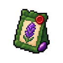</a> <a href="crops.md">거대 라벤더 씨앗</a>
       | 
<a href="crops.md">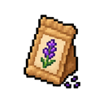</a> <a href="crops.md">라벤더 씨앗</a>
        |
| 
<a href="crops.md">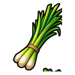</a> <a href="crops.md">레몬그라스</a>
                        | 
 <a href="crops.md">거대 레몬그라스</a>
 |
| 
<a href="crops.md">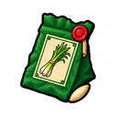</a> <a href="crops.md">거대 레몬그라스 씨앗</a>
 | 
<a href="crops.md">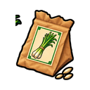</a> <a href="crops.md">레몬그라스 씨앗</a>
  |
| 
<a href="crops.md">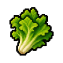</a> <a href="crops.md">상추</a>
                                 | 
 <a href="crops.md">거대 상추</a>
          |
| 
 <a href="crops.md">거대 상추 씨앗</a>
          | 
 <a href="crops.md">상추 씨앗</a>
           |
| 
<a href="crops.md">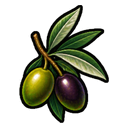</a> <a href="crops.md">올리브</a>
                                 | 
 <a href="crops.md">거대 올리브</a>
          |
| 
 <a href="crops.md">거대 올리브 씨앗</a>
          | 
 <a href="crops.md">올리브 씨앗</a>
           |
| 
 <a href="crops.md">양파</a>
                                   | 
<a href="crops.md">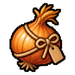</a> <a href="crops.md">거대 양파</a>
            |
| 
 <a href="crops.md">거대 양파 씨앗</a>
            | 
 <a href="crops.md">양파 씨앗</a>
             |
| 
 <a href="crops.md">페퍼민트</a>
                          | 
 <a href="crops.md">거대 페퍼민트</a>
   |
| 
 <a href="crops.md">거대 페퍼민트 씨앗</a>
   | 
 <a href="crops.md">페퍼민트 씨앗</a>
    |
| 
<a href="crops.md">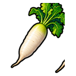</a> <a href="crops.md">무</a>
                                    | 
<a href="crops.md">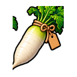</a> <a href="crops.md">거대 무</a>
             |
| 
 <a href="crops.md">거대 무 씨앗</a>
             | 
 <a href="crops.md">무 씨앗</a>
              |
| 
 <a href="crops.md">로즈힙</a>
                               | 
 <a href="crops.md">거대 로즈힙</a>
        |
| 
 <a href="crops.md">거대 로즈힙 씨앗</a>
        | 
 <a href="crops.md">로즈힙 씨앗</a>
         |
| 
 <a href="crops.md">로즈마리</a>
                            | 
 <a href="crops.md">거대 로즈마리</a>
     |
| 
 <a href="crops.md">거대 로즈마리 씨앗</a>
     | 
 <a href="crops.md">로즈마리 씨앗</a>
      |
| 
 <a href="crops.md">딸기</a>
                              | 
 <a href="crops.md">거대 딸기</a>
       |
| 
 <a href="crops.md">거대 딸기 씨앗</a>
       | 
 <a href="crops.md">딸기 씨앗</a>
        |
| 
 <a href="crops.md">토마토</a>
                                | 
 <a href="crops.md">거대 토마토</a>
         |
| 
 <a href="crops.md">거대 토마토 씨앗</a>
         | 
 <a href="crops.md">토마토 씨앗</a>
          |

## 음식과 음료 54종

| 아이템                                                                                                                                                                    | 아이템                                                                                                                                                                             |
| ---------------------------------------------------------------------------------------------------------------------------------------------------------------------- | ------------------------------------------------------------------------------------------------------------------------------------------------------------------------------- |
| 
<a href="food-and-drinks.md">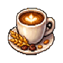</a> <a href="food-and-drinks.md">보리 커피</a>
                 | 
 <a href="food-and-drinks.md">보리죽</a>
                            |
| 
 <a href="food-and-drinks.md">콩 스튜</a>
                       | 
 <a href="food-and-drinks.md">비프 부르기뇽</a>
                   |
| 
 <a href="food-and-drinks.md">맥주</a>
                                | 
 <a href="food-and-drinks.md">블루베리 에이드</a>
                    |
| 
 <a href="food-and-drinks.md">블루베리잼</a>
                 | 
 <a href="food-and-drinks.md">블루베리 머핀</a>
                   |
| 
 <a href="food-and-drinks.md">양배추 고기말이</a>
       | 
 <a href="food-and-drinks.md">캐모마일 티</a>
                        |
| 
 <a href="food-and-drinks.md">치킨버거</a>
                  | 
 <a href="food-and-drinks.md">치킨파이</a>
                              |
| 
 <a href="food-and-drinks.md">커피</a>
                              | 
 <a href="food-and-drinks.md">코울슬로</a>
                                 |
| 
 <a href="food-and-drinks.md">옥수수 수프</a>
                   | 
<a href="food-and-drinks.md">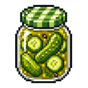</a> <a href="food-and-drinks.md">오이피클</a>
                          |
| 
<a href="food-and-drinks.md">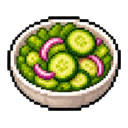</a> <a href="food-and-drinks.md">오이 샐러드</a>
              | 
 <a href="food-and-drinks.md">오색 과일에이드</a>
             |
| 
 <a href="food-and-drinks.md">플라워 블렌드</a>
              | 
 <a href="food-and-drinks.md">가든 블렌드</a>
                         |
| 
 <a href="food-and-drinks.md">황금 곡물 커피</a>
     | 
 <a href="food-and-drinks.md">황금 수확제 커피</a>
 |
| 
 <a href="food-and-drinks.md">포도 에이드</a>
                   | 
 <a href="food-and-drinks.md">햄버거</a>
                                  |
| 
 <a href="food-and-drinks.md">히비스커스 에이드</a>
          | 
 <a href="food-and-drinks.md">히비스커스 티</a>
                       |
| 
 <a href="food-and-drinks.md">자스민 로즈 티</a>
        | 
 <a href="food-and-drinks.md">자스민 티</a>
                            |
| 
<a href="food-and-drinks.md">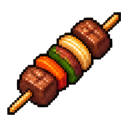</a> <a href="food-and-drinks.md">양고기 꼬치구이</a>
             | 
 <a href="food-and-drinks.md">라벤더 티</a>
                           |
| 
 <a href="food-and-drinks.md">레몬그라스 아이스티</a>
 | 
 <a href="food-and-drinks.md">레몬그라스 티</a>
                     |
| 
 <a href="food-and-drinks.md">미트파이</a>
                        | 
 <a href="food-and-drinks.md">한여름 청량수</a>
         |
| 
 <a href="food-and-drinks.md">민트 블렌드</a>
                  | 
 <a href="food-and-drinks.md">민트 아이스티</a>
                      |
| 
 <a href="food-and-drinks.md">믹스베리 타르트</a>
        | 
 <a href="food-and-drinks.md">믹스드 그릴</a>
                          |
| 
 <a href="food-and-drinks.md">달빛 정원차</a>
        | 
 <a href="food-and-drinks.md">문라이트 티</a>
                        |
| 
 <a href="food-and-drinks.md">양파 수프</a>
                    | 
 <a href="food-and-drinks.md">페퍼민트 티</a>
                       |
| 
 <a href="food-and-drinks.md">피자</a>
                               | 
 <a href="food-and-drinks.md">호박 그라탱</a>
                       |
| 
 <a href="food-and-drinks.md">레드 블렌드</a>
                   | 
 <a href="food-and-drinks.md">로즈힙 에이드</a>
                        |
| 
 <a href="food-and-drinks.md">로즈힙 티</a>
                   | 
<a href="food-and-drinks.md">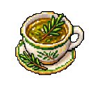</a> <a href="food-and-drinks.md">로즈마리 티</a>
                         |
| 
 <a href="food-and-drinks.md">딸기 에이드</a>
              | 
<a href="food-and-drinks.md">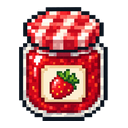</a> <a href="food-and-drinks.md">딸기잼</a>
                             |
| 
 <a href="food-and-drinks.md">딸기잼 토스트</a>
      | 
<a href="food-and-drinks.md">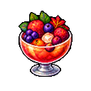</a> <a href="food-and-drinks.md">석양빛 과일 화채</a>
           |
| 
 <a href="food-and-drinks.md">토마토 스파게티</a>
        | 
 <a href="food-and-drinks.md">와인</a>
                                         |

## 광물·제련과 보석 42종

| 아이템                                                                                                                                                                            | 아이템                                                                                                                                                                           |
| ------------------------------------------------------------------------------------------------------------------------------------------------------------------------------ | ----------------------------------------------------------------------------------------------------------------------------------------------------------------------------- |
| 
<a href="gems.md">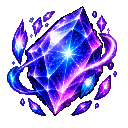</a> <a href="gems.md">아스트라</a>
                                                             | 
<a href="gems.md">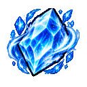</a> <a href="gems.md">아주라</a>
                                                              |
| 
<a href="gems.md">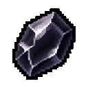</a> <a href="gems.md">흑옥석</a>
                                                           | 
<a href="gems.md">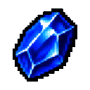</a> <a href="gems.md">청옥석</a>
                                                           |
| 
<a href="gems.md">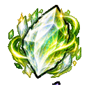</a> <a href="gems.md">플로라</a>
                                                               | 
 <a href="gems.md">녹옥석</a>
                                                          |
| 
<a href="gems.md">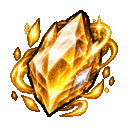</a> <a href="gems.md">루미나</a>
                                                              | 
 <a href="gems.md">루나리스</a>
                                                          |
| 
 <a href="gems.md">네레이아</a>
                                                            | 
 <a href="gems.md">프리즈마</a>
                                                           |
| 
 <a href="gems.md">자옥석</a>
                                                          | 
 <a href="gems.md">홍옥석</a>
                                                            |
| 
<a href="gems.md">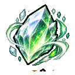</a> <a href="gems.md">셀레네</a>
                                                              | 
 <a href="gems.md">실바리스</a>
                                                         |
| 
 <a href="gems.md">솔레아</a>
                                                               | 
<a href="gems.md">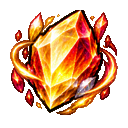</a> <a href="gems.md">솔리스</a>
                                                              |
| 
 <a href="gems.md">순환의 정령석</a>
                                          | 
<a href="gems.md">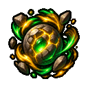</a> <a href="gems.md">대지의 정령석</a>
                                         |
| 
 <a href="gems.md">불의 정령석</a>
                                             | 
 <a href="gems.md">공명의 정령석</a>
                                     |
| 
 <a href="gems.md">물의 정령석</a>
                                            | 
 <a href="gems.md">바람의 정령석</a>
                                          |
| 
<a href="gems.md">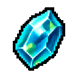</a> <a href="gems.md">청록석</a>
                                                       | 
 <a href="gems.md">베스퍼</a>
                                                             |
| 
 <a href="gems.md">백옥석</a>
                                                           | 
 <a href="gems.md">황옥석</a>
                                                         |
| 
<a href="minerals-and-smelting.md">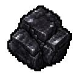</a> <a href="minerals-and-smelting.md">압축 석탄</a>
          | 
<a href="minerals-and-smelting.md">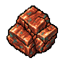</a> <a href="minerals-and-smelting.md">압축 구리</a>
       |
| 
 <a href="minerals-and-smelting.md">압축 다이아몬드</a>
 | 
 <a href="minerals-and-smelting.md">압축 에메랄드</a>
  |
| 
<a href="minerals-and-smelting.md">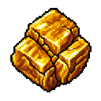</a> <a href="minerals-and-smelting.md">압축 금</a>
            | 
 <a href="minerals-and-smelting.md">압축 철</a>
           |
| 
 <a href="minerals-and-smelting.md">압축 청금석</a>
       | 
<a href="minerals-and-smelting.md">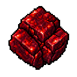</a> <a href="minerals-and-smelting.md">압축 레드스톤</a>
 |
| 
<a href="gems.md">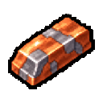</a> <a href="gems.md">기초 합금</a>
                                                | 
 <a href="gems.md">기초 판재</a>
                                               |
| 
<a href="gems.md">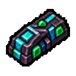</a> <a href="gems.md">고밀도 합금</a>
                                       | 
 <a href="gems.md">고밀도 판재</a>
                                      |
| 
<a href="gems.md">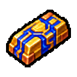</a> <a href="gems.md">정밀 합금</a>
                                            | 
 <a href="gems.md">정밀 판재</a>
                                           |
| 
 <a href="gems.md">강화 합금</a>
                                           | 
 <a href="gems.md">강화 판재</a>
                                          |

## 장신구 36종

| 아이템                                                                                                                                                        | 아이템                                                                                                                                                          |
| ---------------------------------------------------------------------------------------------------------------------------------------------------------- | ------------------------------------------------------------------------------------------------------------------------------------------------------------ |
| 
 <a href="accessories.md">十二月 천궁 — 아스트라</a>
   | 
 <a href="accessories.md">九月 창공 — 아주라</a>
         |
| 
 <a href="accessories.md">초심의 반지</a>
         | 
 <a href="accessories.md">흑옥 목걸이</a>
      |
| 
<a href="accessories.md">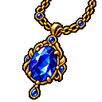</a> <a href="accessories.md">청옥 목걸이</a>
     | 
 <a href="accessories.md">결실의 브로치</a>
      |
| 
 <a href="accessories.md">八月 화관 — 플로라</a>
       | 
 <a href="accessories.md">녹옥 팔찌</a>
        |
| 
 <a href="accessories.md">四月 광휘 — 루미나</a>
      | 
 <a href="accessories.md">二月 월광 — 루나리스</a>
     |
| 
 <a href="accessories.md">바람결 귀걸이</a>
        | 
<a href="accessories.md">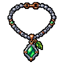</a> <a href="accessories.md">인연의 목걸이</a>
         |
| 
 <a href="accessories.md">三月 해류 — 네레이아</a>
    | 
<a href="accessories.md">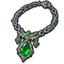</a> <a href="accessories.md">신뢰의 목걸이</a>
        |
| 
 <a href="accessories.md">十月 환채 — 프리즈마</a>
    | 
<a href="accessories.md">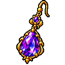</a> <a href="accessories.md">자옥 귀걸이</a>
      |
| 
 <a href="accessories.md">홍옥 반지</a>
            | 
 <a href="accessories.md">장인의 팔찌</a>
        |
| 
 <a href="accessories.md">六月 월화 — 셀레네</a>
      | 
 <a href="accessories.md">흐름의 귀걸이</a>
       |
| 
<a href="accessories.md">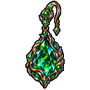</a> <a href="accessories.md">五月 신록 — 실바리스</a>
  | 
 <a href="accessories.md">검소한 팔찌</a>
         |
| 
 <a href="accessories.md">작은 행운의 브로치</a>
 | 
 <a href="accessories.md">숙련의 반지</a>
            |
| 
 <a href="accessories.md">七月 작열 — 솔레아</a>
       | 
 <a href="accessories.md">十一月 여명 — 솔리스</a>
       |
| 
 <a href="accessories.md">순환의 반지</a>
     | 
 <a href="accessories.md">대지의 목걸이</a>
 |
| 
 <a href="accessories.md">불꽃의 브로치</a>
  | 
 <a href="accessories.md">공명의 인장</a>
   |
| 
 <a href="accessories.md">물결의 팔찌</a>
 | 
 <a href="accessories.md">바람의 귀걸이</a>
   |
| 
 <a href="accessories.md">청록 팔찌</a>
      | 
 <a href="accessories.md">一月 황혼 — 베스퍼</a>
        |
| 
 <a href="accessories.md">백옥 반지</a>
          | 
 <a href="accessories.md">황옥 브로치</a>
       |

## 기술 부품·설비·완제품 72종

| 아이템                                                                                                                                                                            | 아이템                                                                                                                                                                              |
| ------------------------------------------------------------------------------------------------------------------------------------------------------------------------------ | -------------------------------------------------------------------------------------------------------------------------------------------------------------------------------- |
| 
 <a href="technical-components.md">회로 기판</a>
                  | 
 <a href="technical-components.md">압축 실린더</a>
           |
| 
 <a href="technical-components.md">전기선</a>
                      | 
 <a href="technical-components.md">변속기</a>
                          |
| 
<a href="technical-components.md">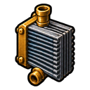</a> <a href="technical-components.md">열교환기</a>
                   | 
 <a href="technical-components.md">가열 코일</a>
                     |
| 
 <a href="technical-components.md">고밀도 부품</a>
            | 
<a href="technical-components.md">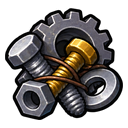</a> <a href="technical-components.md">기계 부품</a>
                     |
| 
 <a href="technical-components.md">마도 코어</a>
                     | 
 <a href="technical-components.md">모터</a>
                                  |
| [전력 릴레이](technical-components.md)                                                                                                                                              | 
 <a href="technical-components.md">압력 탱크</a>
                    |
| 
 <a href="technical-components.md">펌프</a>
                                 | 
 <a href="technical-components.md">조절기</a>
                            |
| 
 <a href="technical-components.md">밀폐 용기</a>
               | 
 <a href="technical-components.md">센서</a>
                                 |
| 
<a href="technical-components.md">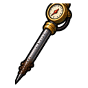</a> <a href="technical-components.md">토양 탐침</a>
                     | 
 <a href="technical-components.md">분류 필터</a>
                   |
| 
 <a href="technical-components.md">분사 노즐</a>
                   | 
 <a href="technical-components.md">급수 밸브</a>
                      |
| 
 <a href="technical-facilities.md">연료통</a>
                          | 
 <a href="technical-facilities.md">레일</a>
                              |
| 
 <a href="technical-facilities.md">재료통</a>
                      | 
 <a href="technical-components.md">마도 제어 장치</a>
               |
| 
 <a href="technical-components.md">마도 코어 외피</a>
               | 
 <a href="technical-components.md">마력 응축기</a>
                 |
| 
 <a href="technical-components.md">정밀 금속판</a>
       | 
 <a href="technical-components.md">기초 금속판</a>
          |
| 
 <a href="technical-components.md">강화 금속판</a>
        | 
 <a href="technical-components.md">고밀도 금속판</a>
        |
| 
 <a href="technical-products.md">자동 블록 압축기</a>
      | [자동 수거기 I](technical-products.md)                                                                                                                                                |
| [자동 수거기 II](technical-products.md)                                                                                                                                             | [자동 수거기 III](technical-products.md)                                                                                                                                              |
| [자동 수거기 IV](technical-products.md)                                                                                                                                             | 
 <a href="technical-products.md">자동 제작대 I</a>
          |
| 
 <a href="technical-products.md">자동 제작대 II</a>
      | 
 <a href="technical-products.md">자동 제작대 III</a>
      |
| 
 <a href="technical-products.md">자동 제작대 IV</a>
      | [자동 파종기 I](technical-products.md)                                                                                                                                                |
| [자동 파종기 II](technical-products.md)                                                                                                                                             | [자동 파종기 III](technical-products.md)                                                                                                                                              |
| [자동 파종기 IV](technical-products.md)                                                                                                                                             | 
 <a href="technical-products.md">상자 정리 장치</a>
                   |
| 
 <a href="technical-products.md">농산물 창고 I</a>
               | 
 <a href="technical-products.md">농산물 창고 II</a>
               |
| 
 <a href="technical-products.md">농산물 창고 III</a>
           | 
 <a href="technical-products.md">농산물 창고 IV</a>
               |
|                                                                                                                                                                                | [재배 알리미 I](technical-products.md)                                                                                                                                                |
| [재배 알리미 II](technical-products.md)                                                                                                                                             | [재배 알리미 III](technical-products.md)                                                                                                                                              |
| [재배 알리미 IV](technical-products.md)                                                                                                                                             | 
 <a href="technical-products.md">고성능 화로 I</a>
     |
| 
 <a href="technical-products.md">고성능 화로 II</a>
 | 
 <a href="technical-products.md">고성능 화로 III</a>
 |
| 
 <a href="technical-products.md">고성능 화로 IV</a>
 | 
 <a href="technical-products.md">광물 창고 I</a>
                |
| 
 <a href="technical-products.md">광물 창고 II</a>
            | 
 <a href="technical-products.md">광물 창고 III</a>
            |
| 
 <a href="technical-products.md">광물 창고 IV</a>
            |                                                                                                                                                                                  |
| 
 <a href="technical-products.md">허수아비 I</a>
                        | 
 <a href="technical-products.md">허수아비 II</a>
                      |
| 
 <a href="technical-products.md">허수아비 III</a>
                  | 
 <a href="technical-products.md">허수아비 IV</a>
                      |
| 
 <a href="technical-products.md">스프링클러 I</a>
                    | 
 <a href="technical-products.md">스프링클러 II</a>
                    |
| 
 <a href="technical-products.md">스프링클러 III</a>
                | 
 <a href="technical-products.md">스프링클러 IV</a>
                    |
|                                                                                                                                                                                | 
 <a href="technical-facilities.md">마도공학 기술대</a>
         |
| 
 <a href="technical-facilities.md">일반 기술대</a>
            | 
 <a href="technical-facilities.md">증기 기술대</a>
              |
| 
 <a href="technical-facilities.md">전기 기술대</a>
         |                                                                                                                                                                                  |

기본 생활 도구와 펫은 [플레이 가이드](../guides/)에서 확인할 수 있습니다.

관련 문서: [도감 첫 화면](./) · [레시피와 제작 조건](recipes.md)
