# 그림으로 찾는 전체 도감

작물·음식·제련·보석·장신구·기술 계열 292종을 그림과 이름으로 찾아보세요. 아이템 이름을 누르면 해당 제작법과 사용처 안내로 이동합니다.

이름은 위키 검색이나 브라우저의 페이지 내 찾기로 검색할 수 있습니다. 그림이 없는 아이템은 이름을 눌러 확인하세요.

## 작물과 씨앗 88종

| 아이템 | 아이템 |
| --- | --- |
|  [보리](crops.md) |  [거대 보리](crops.md) |
| [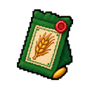](crops.md) [거대 보리 씨앗](crops.md) |  [보리 씨앗](crops.md) |
|  [콩](crops.md) |  [거대 콩](crops.md) |
|  [거대 콩 씨앗](crops.md) |  [콩 씨앗](crops.md) |
|  [블루베리](crops.md) |  [거대 블루베리](crops.md) |
|  [거대 블루베리 씨앗](crops.md) |  [블루베리 씨앗](crops.md) |
|  [양배추](crops.md) |  [거대 양배추](crops.md) |
|  [거대 양배추 씨앗](crops.md) |  [양배추 씨앗](crops.md) |
|  [캐모마일](crops.md) |  [거대 캐모마일](crops.md) |
|  [거대 캐모마일 씨앗](crops.md) |  [캐모마일 씨앗](crops.md) |
|  [옥수수](crops.md) |  [거대 옥수수](crops.md) |
|  [거대 옥수수 씨앗](crops.md) |  [옥수수 씨앗](crops.md) |
|  [오이](crops.md) |  [거대 오이](crops.md) |
|  [거대 오이 씨앗](crops.md) |  [오이 씨앗](crops.md) |
|  [마늘](crops.md) | [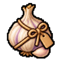](crops.md) [거대 마늘](crops.md) |
| [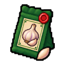](crops.md) [거대 마늘 씨앗](crops.md) |  [마늘 씨앗](crops.md) |
|  [포도](crops.md) |  [거대 포도](crops.md) |
|  [거대 포도 씨앗](crops.md) |  [포도 씨앗](crops.md) |
|  [히비스커스](crops.md) |  [거대 히비스커스](crops.md) |
|  [거대 히비스커스 씨앗](crops.md) |  [히비스커스 씨앗](crops.md) |
|  [자스민](crops.md) |  [거대 자스민](crops.md) |
|  [거대 자스민 씨앗](crops.md) |  [자스민 씨앗](crops.md) |
|  [라벤더](crops.md) |  [거대 라벤더](crops.md) |
|  [거대 라벤더 씨앗](crops.md) |  [라벤더 씨앗](crops.md) |
|  [레몬그라스](crops.md) |  [거대 레몬그라스](crops.md) |
|  [거대 레몬그라스 씨앗](crops.md) |  [레몬그라스 씨앗](crops.md) |
|  [상추](crops.md) |  [거대 상추](crops.md) |
|  [거대 상추 씨앗](crops.md) |  [상추 씨앗](crops.md) |
|  [올리브](crops.md) | [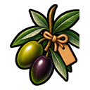](crops.md) [거대 올리브](crops.md) |
|  [거대 올리브 씨앗](crops.md) | [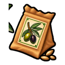](crops.md) [올리브 씨앗](crops.md) |
|  [양파](crops.md) |  [거대 양파](crops.md) |
| [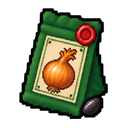](crops.md) [거대 양파 씨앗](crops.md) | [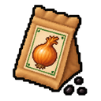](crops.md) [양파 씨앗](crops.md) |
|  [페퍼민트](crops.md) |  [거대 페퍼민트](crops.md) |
|  [거대 페퍼민트 씨앗](crops.md) |  [페퍼민트 씨앗](crops.md) |
|  [무](crops.md) |  [거대 무](crops.md) |
|  [거대 무 씨앗](crops.md) |  [무 씨앗](crops.md) |
|  [로즈힙](crops.md) |  [거대 로즈힙](crops.md) |
|  [거대 로즈힙 씨앗](crops.md) |  [로즈힙 씨앗](crops.md) |
|  [로즈마리](crops.md) |  [거대 로즈마리](crops.md) |
|  [거대 로즈마리 씨앗](crops.md) |  [로즈마리 씨앗](crops.md) |
|  [딸기](crops.md) |  [거대 딸기](crops.md) |
|  [거대 딸기 씨앗](crops.md) |  [딸기 씨앗](crops.md) |
|  [토마토](crops.md) |  [거대 토마토](crops.md) |
|  [거대 토마토 씨앗](crops.md) |  [토마토 씨앗](crops.md) |

## 음식과 음료 54종

| 아이템 | 아이템 |
| --- | --- |
|  [보리 커피](food-and-drinks.md) | [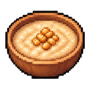](food-and-drinks.md) [보리죽](food-and-drinks.md) |
|  [콩 스튜](food-and-drinks.md) |  [비프 부르기뇽](food-and-drinks.md) |
|  [맥주](food-and-drinks.md) |  [블루베리 에이드](food-and-drinks.md) |
|  [블루베리잼](food-and-drinks.md) |  [블루베리 머핀](food-and-drinks.md) |
|  [양배추 고기말이](food-and-drinks.md) |  [캐모마일 티](food-and-drinks.md) |
|  [치킨버거](food-and-drinks.md) |  [치킨파이](food-and-drinks.md) |
|  [커피](food-and-drinks.md) |  [코울슬로](food-and-drinks.md) |
|  [옥수수 수프](food-and-drinks.md) |  [오이피클](food-and-drinks.md) |
|  [오이 샐러드](food-and-drinks.md) |  [오색 과일에이드](food-and-drinks.md) |
|  [플라워 블렌드](food-and-drinks.md) |  [가든 블렌드](food-and-drinks.md) |
|  [황금 곡물 커피](food-and-drinks.md) |  [황금 수확제 커피](food-and-drinks.md) |
|  [포도 에이드](food-and-drinks.md) |  [햄버거](food-and-drinks.md) |
|  [히비스커스 에이드](food-and-drinks.md) |  [히비스커스 티](food-and-drinks.md) |
|  [자스민 로즈 티](food-and-drinks.md) |  [자스민 티](food-and-drinks.md) |
|  [양고기 꼬치구이](food-and-drinks.md) |  [라벤더 티](food-and-drinks.md) |
|  [레몬그라스 아이스티](food-and-drinks.md) |  [레몬그라스 티](food-and-drinks.md) |
|  [미트파이](food-and-drinks.md) |  [한여름 청량수](food-and-drinks.md) |
|  [민트 블렌드](food-and-drinks.md) |  [민트 아이스티](food-and-drinks.md) |
|  [믹스베리 타르트](food-and-drinks.md) |  [믹스드 그릴](food-and-drinks.md) |
|  [달빛 정원차](food-and-drinks.md) |  [문라이트 티](food-and-drinks.md) |
|  [양파 수프](food-and-drinks.md) |  [페퍼민트 티](food-and-drinks.md) |
|  [피자](food-and-drinks.md) |  [호박 그라탱](food-and-drinks.md) |
|  [레드 블렌드](food-and-drinks.md) |  [로즈힙 에이드](food-and-drinks.md) |
|  [로즈힙 티](food-and-drinks.md) |  [로즈마리 티](food-and-drinks.md) |
|  [딸기 에이드](food-and-drinks.md) |  [딸기잼](food-and-drinks.md) |
|  [딸기잼 토스트](food-and-drinks.md) |  [석양빛 과일 화채](food-and-drinks.md) |
|  [토마토 스파게티](food-and-drinks.md) |  [와인](food-and-drinks.md) |

## 광물·제련과 보석 42종

| 아이템 | 아이템 |
| --- | --- |
|  [아스트라](gems.md) |  [아주라](gems.md) |
|  [흑옥석](gems.md) |  [청옥석](gems.md) |
|  [플로라](gems.md) |  [녹옥석](gems.md) |
|  [루미나](gems.md) |  [루나리스](gems.md) |
| [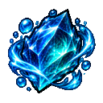](gems.md) [네레이아](gems.md) |  [프리즈마](gems.md) |
|  [자옥석](gems.md) |  [홍옥석](gems.md) |
|  [셀레네](gems.md) |  [실바리스](gems.md) |
|  [솔레아](gems.md) |  [솔리스](gems.md) |
|  [순환의 정령석](gems.md) |  [대지의 정령석](gems.md) |
|  [불의 정령석](gems.md) |  [공명의 정령석](gems.md) |
|  [물의 정령석](gems.md) |  [바람의 정령석](gems.md) |
|  [청록석](gems.md) |  [베스퍼](gems.md) |
| [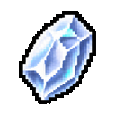](gems.md) [백옥석](gems.md) | [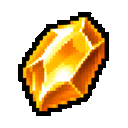](gems.md) [황옥석](gems.md) |
|  [압축 석탄](minerals-and-smelting.md) |  [압축 구리](minerals-and-smelting.md) |
|  [압축 다이아몬드](minerals-and-smelting.md) |  [압축 에메랄드](minerals-and-smelting.md) |
|  [압축 금](minerals-and-smelting.md) |  [압축 철](minerals-and-smelting.md) |
|  [압축 청금석](minerals-and-smelting.md) |  [압축 레드스톤](minerals-and-smelting.md) |
|  [기초 합금](gems.md) | [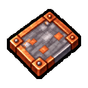](gems.md) [기초 판재](gems.md) |
|  [고밀도 합금](gems.md) | [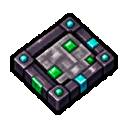](gems.md) [고밀도 판재](gems.md) |
|  [정밀 합금](gems.md) | [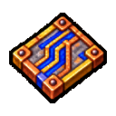](gems.md) [정밀 판재](gems.md) |
|  [강화 합금](gems.md) |  [강화 판재](gems.md) |

## 장신구 36종

| 아이템 | 아이템 |
| --- | --- |
|  [十二月 천궁 — 아스트라](accessories.md) |  [九月 창공 — 아주라](accessories.md) |
|  [초심의 반지](accessories.md) |  [흑옥 목걸이](accessories.md) |
|  [청옥 목걸이](accessories.md) |  [결실의 브로치](accessories.md) |
|  [八月 화관 — 플로라](accessories.md) |  [녹옥 팔찌](accessories.md) |
|  [四月 광휘 — 루미나](accessories.md) |  [二月 월광 — 루나리스](accessories.md) |
|  [바람결 귀걸이](accessories.md) |  [인연의 목걸이](accessories.md) |
|  [三月 해류 — 네레이아](accessories.md) |  [신뢰의 목걸이](accessories.md) |
|  [十月 환채 — 프리즈마](accessories.md) |  [자옥 귀걸이](accessories.md) |
|  [홍옥 반지](accessories.md) |  [장인의 팔찌](accessories.md) |
|  [六月 월화 — 셀레네](accessories.md) |  [흐름의 귀걸이](accessories.md) |
|  [五月 신록 — 실바리스](accessories.md) |  [검소한 팔찌](accessories.md) |
|  [작은 행운의 브로치](accessories.md) |  [숙련의 반지](accessories.md) |
|  [七月 작열 — 솔레아](accessories.md) |  [十一月 여명 — 솔리스](accessories.md) |
|  [순환의 반지](accessories.md) |  [대지의 목걸이](accessories.md) |
|  [불꽃의 브로치](accessories.md) |  [공명의 인장](accessories.md) |
|  [물결의 팔찌](accessories.md) |  [바람의 귀걸이](accessories.md) |
|  [청록 팔찌](accessories.md) |  [一月 황혼 — 베스퍼](accessories.md) |
|  [백옥 반지](accessories.md) |  [황옥 브로치](accessories.md) |

## 기술 부품·설비·완제품 72종

| 아이템 | 아이템 |
| --- | --- |
|  [회로 기판](technical-components.md) |  [압축 실린더](technical-components.md) |
|  [전기선](technical-components.md) |  [변속기](technical-components.md) |
|  [열교환기](technical-components.md) |  [가열 코일](technical-components.md) |
|  [고밀도 부품](technical-components.md) |  [기계 부품](technical-components.md) |
|  [마도 코어](technical-components.md) |  [모터](technical-components.md) |
| [전력 릴레이](technical-components.md) |  [압력 탱크](technical-components.md) |
|  [펌프](technical-components.md) |  [조절기](technical-components.md) |
|  [밀폐 용기](technical-components.md) |  [센서](technical-components.md) |
|  [토양 탐침](technical-components.md) |  [분류 필터](technical-components.md) |
|  [분사 노즐](technical-components.md) |  [급수 밸브](technical-components.md) |
|  [연료통](technical-facilities.md) |  [레일](technical-facilities.md) |
|  [재료통](technical-facilities.md) |  [마도 제어 장치](technical-components.md) |
|  [마도 코어 외피](technical-components.md) |  [마력 응축기](technical-components.md) |
|  [정밀 금속판](technical-components.md) |  [기초 금속판](technical-components.md) |
|  [강화 금속판](technical-components.md) |  [고밀도 금속판](technical-components.md) |
|  [자동 블록 압축기](technical-products.md) | [자동 수거기 I](technical-products.md) |
| [자동 수거기 II](technical-products.md) | [자동 수거기 III](technical-products.md) |
| [자동 수거기 IV](technical-products.md) |  [자동 제작대 I](technical-products.md) |
|  [자동 제작대 II](technical-products.md) |  [자동 제작대 III](technical-products.md) |
|  [자동 제작대 IV](technical-products.md) | [자동 파종기 I](technical-products.md) |
| [자동 파종기 II](technical-products.md) | [자동 파종기 III](technical-products.md) |
| [자동 파종기 IV](technical-products.md) |  [상자 정리 장치](technical-products.md) |
|  [농산물 창고 I](technical-products.md) |  [농산물 창고 II](technical-products.md) |
|  [농산물 창고 III](technical-products.md) |  [농산물 창고 IV](technical-products.md) |
|  | [재배 알리미 I](technical-products.md) |
| [재배 알리미 II](technical-products.md) | [재배 알리미 III](technical-products.md) |
| [재배 알리미 IV](technical-products.md) |  [고성능 화로 I](technical-products.md) |
|  [고성능 화로 II](technical-products.md) |  [고성능 화로 III](technical-products.md) |
|  [고성능 화로 IV](technical-products.md) |  [광물 창고 I](technical-products.md) |
|  [광물 창고 II](technical-products.md) |  [광물 창고 III](technical-products.md) |
|  [광물 창고 IV](technical-products.md) |  |
|  [허수아비 I](technical-products.md) |  [허수아비 II](technical-products.md) |
|  [허수아비 III](technical-products.md) |  [허수아비 IV](technical-products.md) |
|  [스프링클러 I](technical-products.md) |  [스프링클러 II](technical-products.md) |
|  [스프링클러 III](technical-products.md) |  [스프링클러 IV](technical-products.md) |
|  |  [마도공학 기술대](technical-facilities.md) |
|  [일반 기술대](technical-facilities.md) |  [증기 기술대](technical-facilities.md) |
|  [전기 기술대](technical-facilities.md) |  |

기본 생활 도구와 펫은 [플레이 가이드](../guides/README.md)에서 확인할 수 있습니다.

관련 문서: [도감 첫 화면](README.md) · [레시피와 제작 조건](recipes.md)
