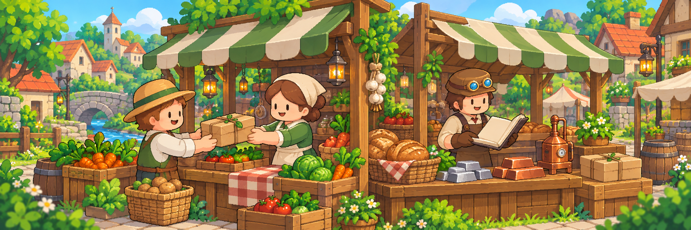

# 경제와 거래

팔 물건이 처음 생겼다면 [주민 상점의 첫 판매 안내](npc-shops.md#first-sale)부터 따라가세요. 거래에 익숙해지면 직접 가격을 정하는 유저거래소와 필요한 물건을 요청하는 주문소로 범위를 넓힐 수 있습니다.

## 거래 경로 비교

| 경로 | 누가 조건을 정하나요? | 어울리는 상황 |
| --- | --- | --- |
| [주민 상점](npc-shops.md) | 서버 | 현재 취급하는 품목을 사고팔고 싶을 때 |
| [유저거래소](player-market.md) | 판매자 | 내 물건과 판매 가격을 정하고 기다릴 때 |
| [주문소](public-orders.md) | 구매자 | 필요한 물건과 보상을 먼저 제시할 때 |
| NPC·섬 퀘스트 | 주민 또는 마을 시스템 | 정해진 수요에 납품하고 추가 성장을 얻을 때 |

## 기본 원칙


**확정 전에 품목·수량·총금액 확인**

- 같은 아이템도 모든 거래 경로에서 사용할 수 있는 것은 아닙니다.
- 판매 경로마다 수수료, 한도와 보상 방식이 다를 수 있습니다.
- 등록·구매·납품·수령 전에는 품목, 수량과 총금액을 다시 확인하세요.
- 돈이나 아이템이 움직인 뒤에는 같은 버튼을 반복해서 누르기 전에 현재 상태를 확인하세요.

정확한 가격, 수수료와 한도는 현재 게임 화면의 운영값을 기준으로 합니다.


## 어떤 거래부터 할까요?

팔 물건이 있다면 먼저 주민 상점의 취급 여부를 확인하고, 직접 가격을 정하고 싶으면 유저거래소를 이용하세요. 필요한 물건을 구하려면 주문소를 이용하세요. 납품 상대를 지정하는 개인 주문은 **주문소 안의 방랑가 전용 기능**입니다. [주문소 하단 안내](public-orders.md#wanderer-private-orders)에서 이어서 확인할 수 있습니다.

돈을 아이템으로 전달하려면 [수표](checks.md), 물건을 선물하려면 [우편함](../guides/storage-and-mail.md)을 이용합니다.
