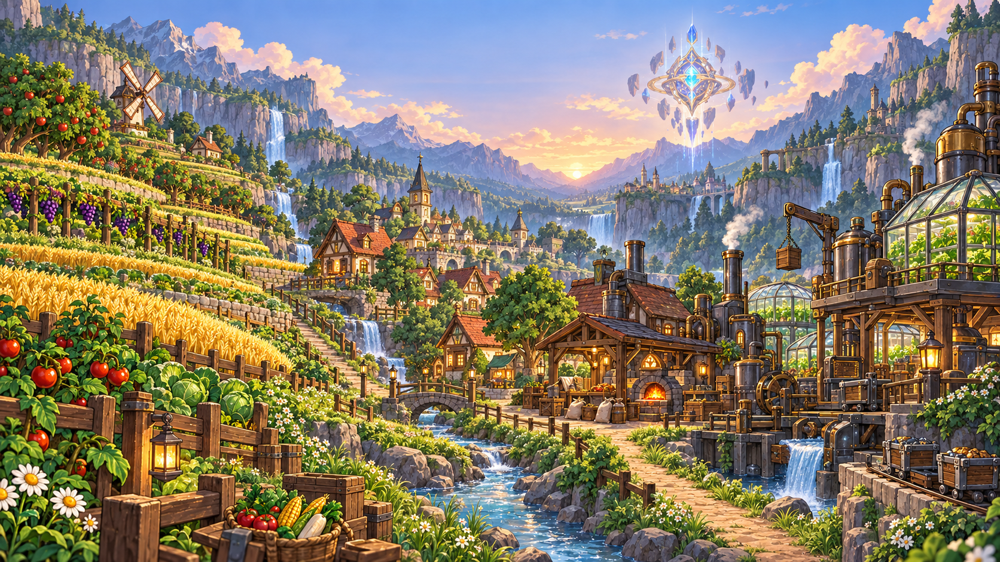

# MineValley 소개

MineValley는 개인 섬에서 농사와 채광을 하고, 마을에서 거래와 주민 의뢰를 즐기는 생활 서버입니다.

## 자유롭게 시작하기

처음부터 한 직업만 강제로 고르지 않습니다. 여러 기본 활동을 체험한 뒤 자신에게 맞는 주 직업을 선택할 수 있습니다.

다른 직업을 선택해도 기본 농사와 채광을 할 수 있습니다. 주 직업을 키우면 해당 분야의 전문 기능을 사용할 수 있습니다.

## 수확물로 만들고 거래하기 

농작물과 광물로 음식과 산업 재료, 기술 제품을 만들 수 있습니다. 필요한 플레이어에게 판매하거나 주문·퀘스트에 납품해 보세요.

무엇을 만들고 어디에 팔 수 있는지는 [생산과 수요의 연결](../world/production-chain.md)에서 살펴보세요.

## 혼자서도, 함께해도

개인 섬에서 혼자 작물을 기르거나 광물을 모아 보세요. 섬원과 물품을 납품하고 다른 플레이어와 필요한 재료를 거래할 수도 있습니다.

## 살아 있는 마을

물건을 사고팔 때는 상점 NPC를, 대화하거나 의뢰를 찾을 때는 마을 주민을 만나세요. 주민마다 머무는 장소와 맡길 수 있는 일이 다릅니다.

## 위키의 역할

처음이라면 [접속 준비](connect.md)와 [처음 10분](first-steps.md)을 따라가세요. 플레이 중 궁금한 아이템이나 직업은 상단 검색으로 찾을 수 있습니다.
