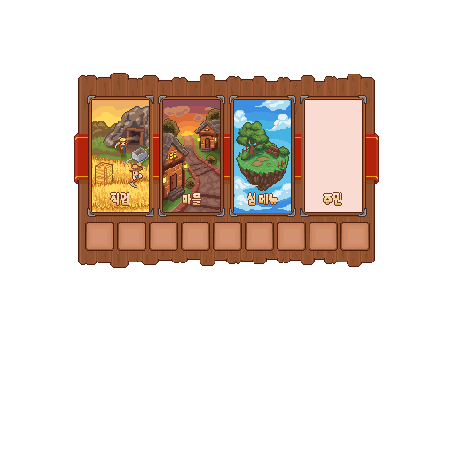

# 메뉴와 이동

메인 메뉴는 MineValley의 주요 시스템으로 이동하는 중심 화면입니다. 같은 기능을 여는 명령이 있더라도 처음에는 메뉴에서 위치와 설명을 확인하는 방식을 권장합니다.

메뉴 원화로 주요 입구를 소개합니다. 실제 버튼 안내와 활성 상태는 현재 게임 화면에서 확인하세요.

## 상단의 주요 입구

| 입구 | 할 수 있는 일 |
| --- | --- |
| 직업 | 다섯 직업의 프로필, 레벨, 경험치, 스킬과 해금 기능 확인 |
| 마을 이동 | 상점과 주요 시설이 있는 마을 중심으로 이동 |
| 내 섬 | 개인 섬 이동, 섬 정보, 기여도와 섬 퀘스트 확인 |
| 마을 주민 | 발견한 주민과 관계·퀘스트 정보 확인 |

마을 주민 입구는 주민의 실제 배치와 공개 상태에 따라 이용 범위가 달라질 수 있습니다.

## 하단의 생활 기능

- **상점·거래**: 주민 상점, 유저거래소와 주문소으로 이동합니다.
- **개인창고**: 일반 아이템을 보관하는 개인 공간을 엽니다.
- **우편함**: 받은 선물과 운영 지급을 확인하고 수령합니다.

## 직업 화면 읽기

직업 프로필에서 현재 레벨과 경험치 진행을 확인할 수 있습니다. 성장표는 레벨에 따라 얻는 능력과 달성 상태를 보여 주는 화면입니다. 칸을 눌러 능력을 구매하는 방식이 아니며, 전문 해금 화면에서는 현재 전직·레벨 조건을 확인합니다.

전직 후에는 현재 직업이 먼저 표시되며, 다른 직업 비교 화면을 통해 나머지 직업의 프로필도 확인할 수 있습니다.

## 보이지 않거나 열리지 않을 때

1. 리소스팩이 정상 적용됐는지 확인합니다.
2. 버튼 설명에 `준비 중` 또는 필요한 조건이 표시되는지 확인합니다.
3. 창을 닫았다가 메인 메뉴에서 다시 진입합니다.
4. 계속 열리지 않으면 화면에 나온 문구와 시각을 기록해 문의합니다.
