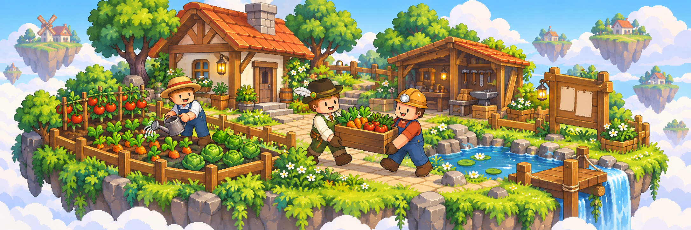

# 섬과 마을

내 섬에서 밭을 가꾸고, 섬원과 물품을 모아 퀘스트에 납품할 수 있습니다. 마을에서는 여러 섬이 이번 주에 필요한 물품을 함께 납품합니다.

## 개인 섬

메인 메뉴에서 `내 섬`을 열면 섬 이동, 섬원 관리와 퀘스트를 확인할 수 있습니다. 처음에는 내 섬으로 이동해 생산할 물품을 고르고, 섬원이 있다면 준비할 일을 나누어 보세요.

* 내 섬으로 이동하기
* 섬원과 권한 관리하기
* 이번 주 섬 기여도와 섬 퀘스트 확인하기
* 섬원과 함께 물품 납품하기

## 섬 단위로 계산되는 것

섬원들이 납품한 물품은 섬 퀘스트의 진행도에 함께 반영됩니다. 내 활동 기록과 섬 전체의 진행도는 다를 수 있으니 각각 확인하세요.

주중에 새로 만든 섬은 참여할 수 있는 시점과 활동이 다를 수 있습니다. 새 섬 화면의 안내를 먼저 확인하세요.

## 마을의 주간 변화

이번 주 테마에 따라 마을에서 필요로 하는 물품이 달라집니다. 여러 섬이 공공 납품에 참여하면 마을 단계가 올라가고, 한 주가 끝나면 순위와 보상을 확인할 수 있습니다.

## 오늘 참여할 순서



### 이번 주 상태 확인

내 섬의 이번 주 상태와 오늘의 퀘스트를 확인합니다.



### 섬원과 물품 분담

섬원이 준비할 물품을 나누고 현재 남은 수량을 확인합니다.



### 납품 후 진행 확인

납품한 뒤 퀘스트 진행과 섬 기여도를 확인합니다.



### 정산과 보상 확인

마을 단계와 정산 후 보상함을 확인합니다.




**주간 일정은 한국 실제 시각 기준**

게임 속 낮·밤과 다릅니다. **월요일 00:00 마감 · 06:00 새 주차 시작**입니다.


<table data-view="cards"><thead><tr><th></th><th></th><th data-hidden data-card-target data-type="content-ref"></th></tr></thead><tbody><tr><td><strong>섬 퀘스트에 납품하기</strong></td><td>요구 물품, 남은 수량과 납품 후 확인할 내용</td><td><a href="contribution-and-quests.md">contribution-and-quests.md</a></td></tr><tr><td><strong>이번 주 일정 확인하기</strong></td><td>마감 시간, 주간 테마와 정산 후 보상 확인</td><td><a href="weekly-cycle.md">weekly-cycle.md</a></td></tr></tbody></table>
