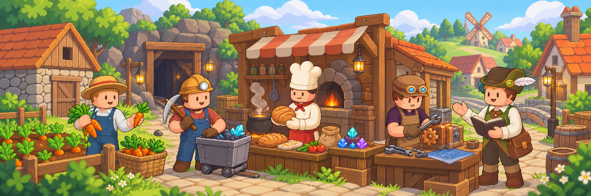

# 직업과 성장

농부, 광부, 가공사, 기술자, 방랑가 중 좋아하는 직업을 골라 보세요. 기본 활동을 먼저 해 보고 주 직업을 정하면 더 높은 레벨과 전문 기능에 도전할 수 있습니다.

## 어떤 생활을 해 보고 싶나요?

<table data-view="cards"><thead><tr><th></th><th></th><th data-hidden data-card-target data-type="content-ref"></th></tr></thead><tbody><tr><td><i class="fa-seedling">:seedling:</i> <strong>농부</strong></td><td>작물을 기르고 밭을 돌보고 싶어요 작물, 수확, 농작물창고, 농사 장비</td><td><a href="farmer.md">farmer.md</a></td></tr><tr><td><i class="fa-gem">:gem:</i> <strong>광부</strong></td><td>광석을 캐고 잠광으로 재료를 모으고 싶어요 무한광산, 잠광, 광물창고, 광맥</td><td><a href="miner.md">miner.md</a></td></tr><tr><td><i class="fa-utensils">:utensils:</i> <strong>가공사</strong></td><td>음식과 장신구를 직접 만들고 싶어요 레시피, 품질, 숙련, 세공</td><td><a href="processor.md">processor.md</a></td></tr><tr><td><i class="fa-screwdriver-wrench">:screwdriver-wrench:</i> <strong>기술자</strong></td><td>생활 장비와 생산 설비를 조립하고 싶어요 조립대, 제품, 생산 라인, 마도공학</td><td><a href="technician.md">technician.md</a></td></tr><tr><td><i class="fa-compass">:compass:</i> <strong>방랑가</strong></td><td>주민을 만나고 의뢰에 필요한 물건을 구하고 싶어요 관계, 의뢰, 거래, 개인 주문</td><td><a href="wanderer.md">wanderer.md</a></td></tr></tbody></table>

## 직업 페이지는 이렇게 읽어요

각 직업은 **시작 방법 → 해금 조건 → 사용법과 주의사항 → 다음 목표** 순서로 안내합니다. 처음에는 준비물과 첫 목표만 보고 시작해도 됩니다.

이미 활동 중이라면 해당 직업 페이지의 **해금 조건**에서 다음 성장 구간을, **사용법과 주의사항**에서 기본 조작과 보관·수령 방법을 확인하세요.

## 선택하기 전에


**체험과 주 직업은 다릅니다**

* 주 직업을 정하기 전에도 다섯 직업을 체험할 수 있습니다.
* 다른 직업을 선택했다고 기본 활동 자체가 금지되지는 않습니다.
* 체험 상한보다 높은 레벨까지 키우려면 주 직업을 정해야 합니다. 직업 효과도 현재 주 직업을 기준으로 적용됩니다.
* 일반 능력은 고정 성장표를 따라 오르며, 특수 성장 칸에서는 액티브·전문 해금·보조 패시브를 확인합니다.

자세한 규칙은 [직업 성장 방식](growth.md)에서 확인하세요.


## 다른 직업과 함께하기 

농부의 작물과 광부의 광물로 음식·음료·합금·보석을 만들 수 있습니다. 기술자는 부품으로 생활 장비와 생산 설비를 만들고, 방랑가는 주민 의뢰에 필요한 물건을 구합니다.

다른 플레이어와 역할을 나누거나, 필요한 기초 활동을 직접 하면서 자신이 좋아하는 분야를 깊게 키울 수 있습니다.

다음으로 읽기: [직업 성장 방식](growth.md) · [생산과 수요의 연결](../world/production-chain.md) · [아이템·레시피 도감](../atlas/)
