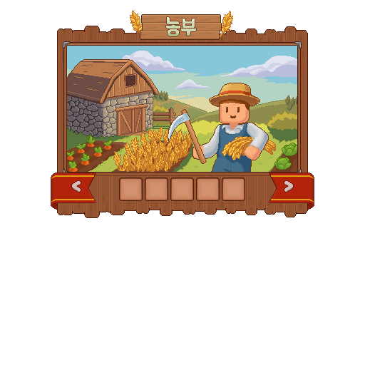

# 농부

농부는 작물을 기르고 수확하며 밭의 생산성과 편의 기능을 성장시키는 직업입니다. 씨앗 하나에서 시작해 나만의 밭을 키우고 싶은 분께 잘 맞아요.

| 시작 전에 | 확인할 내용 |
| --- | --- |
| 먼저 준비할 것 | 밭, 씨앗, 물 |
| 첫 목표 | 씨앗을 심고 물을 준 뒤 수확 상태 확인 |
| 처음 읽을 사용법 | [농사](../world/farming.md) |

<figure><figcaption>
농부 직업 메뉴 원화
</figcaption></figure>

## <i class="fa-compass">:compass:</i> 시작 방법 




### 밭과 씨앗 준비

재배 가능한 밭, 씨앗과 물을 준비합니다.



### 심고 물 주기

씨앗을 심은 뒤 밭에 물을 주고 성장 상태를 확인합니다.



### 수확 후 사용처 정하기

다 자란 작물을 수확하고 보관·가공·판매 중 다음 사용처를 정합니다.




첫 재배는 [농사 안내](../world/farming.md)를 따라가고, 키울 작물은 [작물 도감](../atlas/crops.md)에서 골라 보세요.

## <i class="fa-seedling">:seedling:</i> 해금 조건 

수확으로 직업 경험치를 얻으며 재배와 밭 운영의 선택지를 넓힙니다. 기본 농사는 농부가 아니어도 시작할 수 있지만, 허브·대형 작물 등 전문 기능은 별도 조건을 확인하세요.

공통 규칙은 [직업 성장 방식](growth.md)에서 확인하세요.

2026년 9월 11일 서버의 성장 설정과 스킬 표시 기준입니다. 표시된 레벨 외에도 현재 주직업·전직 조건과 해당 기능의 사용 조건을 확인하세요.





| 레벨 | 성장 내용 |
| ---: | --- |
| 10 | 범위 베기 |
| 40 | 트랙터 설치 |
| 70 | 대쉬 베기 |





| 레벨 | 성장 내용 |
| ---: | --- |
| 20 | 약초 농사 |
| 50 | 거대 작물 |
| 80 | 숙련된 손길 |





| 레벨 | 성장 내용 |
| ---: | --- |
| 30 | 수확의 여운 |
| 60 | 약초의 향기 |
| 90 | 풍년의 결실 |





## <i class="fa-screwdriver-wrench">:screwdriver-wrench:</i> 사용법과 주의사항 

### 액티브 기본 입력

| 스킬 | 기본 입력 동작 |
| --- | --- |
| 범위 베기 | 아이템 버리기 |
| 트랙터 설치 | 손 바꾸기 |
| 대쉬 베기 | 웅크리기 두 번 |


**사용 전에 확인하세요**

해금 후 **스킬 입력 설정**을 확인하고 사용하세요. 입력을 변경했거나 특정 화면을 열어 둔 경우 동작이 달라질 수 있습니다.


### 도구와 보관

스프링클러, 성장 알리미와 허수아비는 밭 운영에 쓰이는 농업 설비입니다. 설치 전에 제품 설명에서 범위와 조건을 확인하세요. 단계별 제작법은 [기술 완제품 도감](../atlas/technical-products.md)에 정리되어 있습니다.

### 농작물창고

농작물창고는 농부만의 인벤토리가 아니라 모든 플레이어가 사용할 수 있는 농사 기반 시설입니다. 지원되는 작물은 수확과 보관 흐름에 연결되며, 필요할 때 꺼내 가공하거나 납품할 수 있습니다.

## <i class="fa-route">:route:</i> 다음 목표 

수확했다면 **보관 → 사용처 선택**까지 이어가세요. 농작물창고에 보관하거나, [주민 상점에서 판매 가능 여부](../economy/npc-shops.md#first-sale)를 확인하거나, [작물 도감](../atlas/crops.md)에서 가공 재료로 쓰이는 곳을 찾아볼 수 있습니다.

밭 운영에 익숙해지면 스프링클러·자동심기·자동줍기 등 편의 기능과 장비를 확인하세요. 작물은 주민·섬 퀘스트와 다른 플레이어의 주문에도 쓰입니다.

### 관련 도감과 사용법

<table data-view="cards"><thead><tr><th></th><th></th><th data-hidden data-card-target data-type="content-ref"></th></tr></thead><tbody><tr><td><strong>작물 도감</strong></td><td>씨앗·수확물과 가공 사용처</td><td><a href="../atlas/crops.md">작물 도감</a></td></tr><tr><td><strong>농사</strong></td><td>물 관리, 대형 작물과 장비 이용</td><td><a href="../world/farming.md">농사</a></td></tr><tr><td><strong>창고와 우편함</strong></td><td>생산물 보관과 꺼내기</td><td><a href="../guides/storage-and-mail.md">창고와 우편함</a></td></tr></tbody></table>

- [직업 비교하기](README.md) · [가공사](processor.md) · [기술자](technician.md)
