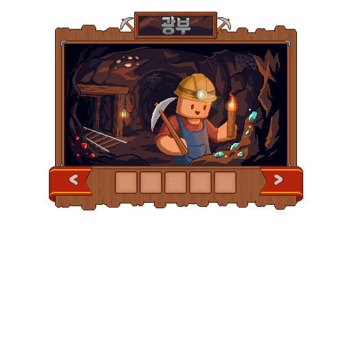

# 광부

광부는 직접 광석을 캐거나 접속 중 잠광으로 광물을 모으는 직업입니다. 성장하면 채광을 돕는 스킬과 새로운 광산 활동을 이용할 수 있습니다.

| 시작 전에     | 확인할 내용                       |
| --------- | ---------------------------- |
| 먼저 준비할 것  | 곡괭이와 보관 공간                   |
| 첫 목표      | 무한광산에서 직접 채광해 보기             |
| 처음 읽을 사용법 | [광산과 잠광](../world/mining.md) |

<figure><figcaption>
광부 직업 메뉴 원화
</figcaption></figure>

## <i class="fa-compass">:compass:</i> 시작 방법 



### 직접 채광 체험

곡괭이를 준비하고 개인 섬의 무한광산에서 직접 채광을 해 봅니다.



### 잠광 준비

잠광을 시작하려면 곡괭이 상태와 `/광물창고`의 남은 공간을 확인하고 `/잠광`으로 시작합니다.



### 종료·정산 후 창고 확인

`/잠광상태`로 진행을 확인하고 `/잠광종료`로 종료·정산합니다. 이후 `/광물창고`에서 산출물을 확인하세요.



시작·상태 확인·종료 명령은 [광산과 잠광](../world/mining.md)에서 확인하세요.

## <i class="fa-gem">:gem:</i> 해금 조건 

채광과 잠광으로 성장하고, 이후 광맥·이동 잠광·유물 관련 활동을 확인합니다. 활동마다 진입 조건과 종료 방식이 다르므로 해금 안내를 함께 읽으세요.

공통 규칙은 [직업 성장 방식](growth.md)에서 확인하세요.

2026년 9월 11일 성장표와 스킬 안내 기준입니다. 표시된 레벨 외에도 현재 주직업·전직 조건과 해당 기능의 사용 조건을 확인하세요.



| 레벨 | 성장 내용     |
| -: | --------- |
| 10 | 바닐라 도구 수리 |
| 40 | 원하는 광물 등록 |
| 70 | 텔레포트      |



| 레벨 | 성장 내용 |
| -: | ----- |
| 20 | 광맥 탐색 |
| 50 | 이동잠광  |
| 80 | 유물 해금 |



| 레벨 | 성장 내용  |
| -: | ------ |
| 30 | 경험 보관  |
| 60 | 입장권 분해 |
| 90 | 내용 미정  |



## <i class="fa-screwdriver-wrench">:screwdriver-wrench:</i> 사용법과 주의사항 

### 액티브 기본 입력

| 스킬        | 기본 입력 동작 |
| --------- | -------- |
| 바닐라 도구 수리 | 손 바꾸기    |
| 원하는 광물 등록 | 아이템 버리기  |
| 텔레포트      | 웅크리기 두 번 |


**사용 전에 확인하세요**

해금 후 **스킬 입력 설정**을 확인하고 사용하세요. 입력을 변경했거나 특정 화면을 열어 둔 경우 동작이 달라질 수 있습니다.


### 무한광산과 잠광의 차이

**무한광산**에서는 광석 블록을 직접 캡니다. **온라인 잠광**은 `/잠광`으로 시작하며, 접속한 동안 사용 중인 곡괭이에 따라 광물을 모읍니다.

잠광을 끝내면 모은 광물이 광물창고로 들어갑니다. 무한광산에서 직접 캔 아이템은 자동으로 광물창고에 들어가지 않으므로 따로 보관하세요.

### 광물창고

광물창고는 잠광 산출물을 보관하고 꺼내는 전용 공간입니다. 창고가 가득 차면 추가 생산이나 관련 보상이 진행되지 않을 수 있으므로 잠광 전 남은 공간을 확인하세요.


**잠광은 접속 중에 진행됩니다.** 종료·정산 후 창고를 확인하세요. 광맥은 일반 잠광과 별도 진행 상태이므로 중단할 때도 광맥 전용 종료 방법을 사용합니다.


## <i class="fa-route">:route:</i> 다음 목표 

직접 캔 아이템과 잠광 정산품의 보관 장소를 확인했다면 **판매 또는 가공 재료 준비**를 다음 목표로 정해 보세요. [주민 상점](../economy/npc-shops.md#first-sale)에서 취급 여부를 확인하거나, 압축 광물·합금·보석의 제작 재료를 모을 수 있습니다.

성장 후에는 해금된 광맥과 유물 활동을 살펴보세요. 모은 광물은 장신구, 기술 부품과 설비를 만드는 데도 쓰입니다.

### 관련 도감과 사용법

<table data-view="cards"><thead><tr><th></th><th></th><th data-hidden data-card-target data-type="content-ref"></th></tr></thead><tbody><tr><td><strong>광물·제련 도감</strong></td><td>압축 광물과 합금·판재</td><td><a href="../atlas/minerals-and-smelting.md">minerals-and-smelting.md</a></td></tr><tr><td><strong>보석·정령석 도감</strong></td><td>보석 재료와 제작 방법</td><td><a href="../atlas/gems.md">gems.md</a></td></tr><tr><td><strong>광산과 잠광</strong></td><td>활동별 명령과 산출물 보관</td><td><a href="../world/mining.md">mining.md</a></td></tr></tbody></table>

* [직업 비교하기](./) · [가공사](processor.md) · [기술자](technician.md)
