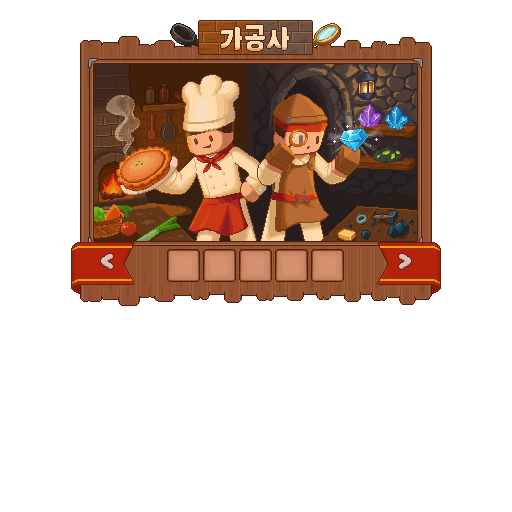

# 가공사

가공사는 작물과 광물 같은 원재료를 음식, 산업 재료와 더 높은 가치의 제품으로 바꾸는 직업입니다.


**이런 생활을 좋아한다면**

재료를 모아 요리부터 장신구까지 직접 완성하는 즐거움을 느껴 보세요.


## 시작 방법 

| 시작 전에 | 확인할 내용 |
| --- | --- |
| 먼저 준비할 것 | 품목에 맞는 가공대와 레시피 재료, 필요 시 물 |
| 첫 목표 | 이용 가능한 레시피 하나의 완성품 수령 |
| 먼저 열 화면 | `/가공도감` |




### 레시피 선택

`/가공도감`에서 현재 이용 가능한 품목 하나를 고릅니다.



### 재료 준비

해당 품목을 지원하는 가공대와 필요한 재료·수량을 확인합니다.



### 가공 후 완성품 수령

재료를 투입해 제작을 시작하고, 완료 후 결과물을 수령합니다.




시설에 따라 물도 필요합니다. 첫 제작은 [가공 안내](../world/processing.md)의 순서를 따라가세요.

## 해금 조건 

가공을 반복하면 직업 경험치와 레시피별 숙련이 쌓입니다. **직업 레벨과 레시피 숙련은 별개**이며, 품목의 사용 가능 상태는 도감과 시설 화면에서 확인하세요.

공통 규칙은 [직업 성장 방식](growth.md)에서 확인하세요.

2026년 9월 11일 서버의 성장 설정과 스킬 표시 기준입니다. 표시된 레벨 외에도 현재 주직업·전직 조건과 해당 기능의 사용 조건을 확인하세요.





| 레벨 | 성장 내용 |
| ---: | --- |
| 10 | 가공품 도감 |
| 40 | 범위형 가공시간 버프 |
| 70 | 원격 가공소 현황 |





| 레벨 | 성장 내용 |
| ---: | --- |
| 20 | 세공 |
| 50 | 바리스타 |
| 80 | 가공품 조합 — 준비 중 |





| 레벨 | 성장 내용 |
| ---: | --- |
| 30 | 장인의 눈 |
| 60 | 향의 각인 |
| 90 | 대접 |





## 사용법과 주의사항 

### 액티브 기본 입력

| 스킬 | 기본 입력 동작 |
| --- | --- |
| 가공품 도감 | 아이템 버리기 |
| 범위형 가공시간 버프 | 웅크리기 두 번 |
| 원격 가공소 현황 | 손 바꾸기 |


**사용 전에 확인하세요**

해금 후 **스킬 입력 설정**을 확인하고 사용하세요. 입력을 변경했거나 특정 화면을 열어 둔 경우 동작이 달라질 수 있습니다.


### 만들고 싶은 분야 고르기

| 분야 | 만드는 것 | 상세 도감 |
| --- | --- | --- |
| 요리·음료 | 요리, 제빵, 커피와 허브 음료 | [음식·음료](../atlas/food-and-drinks.md) |
| 광물 가공 | 압축 광물, 합금과 판재 | [광물·제련](../atlas/minerals-and-smelting.md) |
| 보석 가공 | 보석, 정령석과 탄생석 | [보석·정령석](../atlas/gems.md) |
| 세공 | 반지, 귀걸이, 목걸이 등 장신구 | [장신구](../atlas/accessories.md) |


**완성품 수령까지가 한 번의 제작입니다.** 새 제작을 시작하기 전에 이전 결과물을 수령했는지 확인하세요. 제작이 시작되지 않으면 지원 레시피·정품 재료·수량과 시설의 물 상태를 확인합니다.


## 다음 목표 

첫 완성품을 받았다면 같은 레시피의 숙련을 쌓거나 다른 제작 분야를 골라 보세요. 품질의 적용 방식은 품목마다 다릅니다.

완성품은 직접 사용하거나 상점·유저거래소·주문소·주민과 섬 퀘스트에 활용할 수 있습니다. 모든 품목이 모든 판매 경로를 가지는 것은 아니므로 [거래 경로](../economy/README.md)를 확인하세요.

작물은 농부에게, 광물은 광부에게 구하고, 만든 합금·판재는 기술자의 부품·설비 재료로 연결할 수도 있습니다.

### 관련 도감과 사용법

<table data-view="cards"><thead><tr><th></th><th></th><th data-hidden data-card-target data-type="content-ref"></th></tr></thead><tbody><tr><td><strong>가공</strong></td><td>시설 이용, 물과 제작 상태 확인</td><td><a href="../world/processing.md">가공</a></td></tr><tr><td><strong>레시피와 제작 조건</strong></td><td>필요한 재료와 해금 조건 읽기</td><td><a href="../atlas/recipes.md">레시피와 제작 조건</a></td></tr><tr><td><strong>경제와 거래</strong></td><td>완성품의 판매·주문 경로</td><td><a href="../economy/README.md">경제와 거래</a></td></tr></tbody></table>

- [직업 비교하기](README.md) · [농부](farmer.md) · [광부](miner.md) · [기술자](technician.md)
