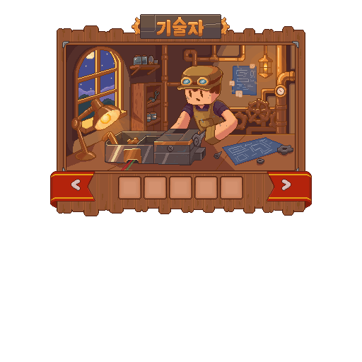

# 기술자

기술자는 재료와 부품을 조립해 기능성 제품과 설비를 만들고, 생산 라인을 연결해 공방을 확장하는 직업입니다.


**이런 생활을 좋아한다면**

부품 하나부터 시작해 나만의 생산 공방을 구성하고 싶은 분께 잘 맞아요.


## 시작 방법 

| 시작 전에 | 확인할 내용 |
| --- | --- |
| 먼저 준비할 것 | 제품을 지원하는 조립대, 재료와 중간 부품 |
| 첫 목표 | 이용 가능한 제품 하나를 조립하고 수령 |
| 처음 읽을 사용법 | [기술 설비](../world/technology.md) |




### 제품 선택

이용 가능한 조립대에서 만들 제품을 고릅니다.



### 재료와 부품 투입

요구되는 재료와 중간 부품을 준비해 투입합니다.



### 조립 후 수령

조립을 시작하고 완료된 제품을 수령합니다.



### 설치와 공급 확인

제품 설명에 따라 사용하거나 설치하고, 필요한 공급 조건을 확인합니다.




첫 조립은 [기술 설비 안내](../world/technology.md), 재료 준비는 [기술 재료·부품 도감](../atlas/technical-components.md)에서 이어가세요.

## 해금 조건 

기본 단계에서 증기·전기·마도공학 계열로 제작 범위를 넓힙니다. 새 설비를 준비하기 전에 **직업 해금 상태와 조립대의 제작 목록**을 함께 확인하세요.

공통 규칙은 [직업 성장 방식](growth.md)에서 확인하세요.

2026년 9월 11일 서버의 성장 설정과 스킬 표시 기준입니다. 표시된 레벨 외에도 현재 주직업·전직 조건과 해당 기능의 사용 조건을 확인하세요.





| 레벨 | 성장 내용 |
| ---: | --- |
| 10 | 수리소 |
| 40 | 오버클럭 |
| 70 | 기술자의 의자 |





| 레벨 | 성장 내용 |
| ---: | --- |
| 20 | 증기기술 업데이트 |
| 50 | 전기기술 업데이트 |
| 80 | 마도공학기술 업데이트 — 성장표상 준비 중 |





| 레벨 | 성장 내용 |
| ---: | --- |
| 30 | 정비사의 눈 |
| 60 | 설계도 |
| 90 | 내용 미정 |





## 사용법과 주의사항 

### 액티브 기본 입력

| 스킬 | 기본 입력 동작 |
| --- | --- |
| 수리소 | 손 바꾸기 |
| 오버클럭 | 아이템 버리기 |
| 기술자의 의자 | 웅크리기 두 번 |


**사용 전에 확인하세요**

해금 후 **스킬 입력 설정**을 확인하고 사용하세요. 입력을 변경했거나 특정 화면을 열어 둔 경우 동작이 달라질 수 있습니다.


마도공학 기술대 아이템의 제작·설치와 성장표의 전문 효과 개방은 별도로 구분됩니다. 자세한 현재 상태는 [기술대 도감](../atlas/technical-facilities.md)을 확인하세요.

### 생산 라인

생산 라인은 조립대와 공급 설비를 연결해 재료와 연료가 흐르는 구조를 만듭니다. 연결 상태와 설비 조건이 맞지 않으면 생산이 시작되지 않거나 중간에서 멈출 수 있습니다.

`/라인` 또는 `/기술자라인`으로 바라보는 작업대의 연결 상태를 확인할 수 있습니다. 문제가 생기면 설비를 반복해서 부수기 전에 조립대 상태, 연결, 재료와 연료를 차례로 확인하세요.

## 다음 목표 

첫 제품을 수령했다면 **사용 방식과 공급 조건**을 확인하세요. 농사 지원·생산물 저장·가공 보조 중 현재 필요한 기능 하나를 정하면 다음 제작 목표를 고르기 쉽습니다.

가공사가 만든 중간재는 기술 부품과 설비로 이어집니다. 원재료를 모두 혼자 해결할 필요는 없으며, 다른 생산자의 물품을 준비해 기능성 제품으로 완성할 수 있습니다.

### 현재 제작 규모

LIVE 운영본에는 기술 재료·부품 27종, 기술대·기반 설비 7종과 완제품 41종이 있습니다. 일반 조립식은 총 72종이며, 세계의 근원·월드코어·무한 제품은 별도 엔드게임 흐름에 속합니다.

### 관련 도감과 사용법

<table data-view="cards"><thead><tr><th></th><th></th><th data-hidden data-card-target data-type="content-ref"></th></tr></thead><tbody><tr><td><strong>기술 재료·부품 도감</strong></td><td>조립 전 필요한 중간재</td><td><a href="../atlas/technical-components.md">기술 재료·부품 도감</a></td></tr><tr><td><strong>기술대·기반 설비 도감</strong></td><td>작업대와 공급 설비</td><td><a href="../atlas/technical-facilities.md">기술대·기반 설비 도감</a></td></tr><tr><td><strong>기술 완제품 도감</strong></td><td>제품별 제작법과 사용 방식</td><td><a href="../atlas/technical-products.md">기술 완제품 도감</a></td></tr><tr><td><strong>세계의 근원과 월드코어</strong></td><td>후반 성장과 현재 공개 범위</td><td><a href="../atlas/world-core.md">세계의 근원과 월드코어</a></td></tr></tbody></table>

- [직업 비교하기](README.md) · [가공사](processor.md)
