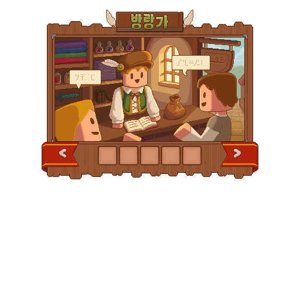

# 방랑가

방랑가는 마을과 거래처를 돌아다니며 주민의 요청, 물품의 수요와 이동 경로를 기회로 바꾸는 직업입니다.


**이런 생활을 좋아한다면**

주민을 만나고 필요한 물건의 주인을 찾아 주는 생활을 즐겨 보세요.


## 시작 방법 

| 시작 전에 | 확인할 내용 |
| --- | --- |
| 먼저 확인할 것 | 주민이 제안한 품목·수량·기한 |
| 첫 목표 | 수행 가능한 요청 하나를 골라 보고까지 완료 |
| 처음 읽을 사용법 | [주민 대화와 퀘스트](../npc-quests.md) |




### 주민 만나기

마을 주민을 만나 현재 이용할 수 있는 의뢰를 확인합니다.



### 요청 조건 확인

요구 품목·수량·기한을 살펴보고 수행할 의뢰를 수락합니다.



### 물품 준비

필요한 물품을 직접 생산하거나 거래로 준비합니다.



### 보고와 보상 수령

완료 조건을 채운 뒤 주민에게 보고하고 보상 수령까지 확인합니다.




주민마다 제공하는 기능은 다릅니다. [NPC와 퀘스트](../npc-quests.md)에서 대화·수락·보고 흐름을 먼저 살펴보세요.

## 해금 조건 

주민과 관계를 쌓고 의뢰를 정상적으로 완료하며 성장합니다. **열람이나 수락만으로 완료 보상과 직업 성장이 지급되지는 않습니다.**

공통 규칙은 [직업 성장 방식](growth.md)에서 확인하세요.

2026년 9월 11일 서버의 성장 설정과 스킬 표시 기준입니다. 표시된 레벨 외에도 현재 주직업·전직 조건과 해당 기능의 사용 조건을 확인하세요.





| 레벨 | 성장 내용 |
| ---: | --- |
| 10 | 대쉬 |
| 40 | 판로 도감 |
| 70 | 속마음 |





| 레벨 | 성장 내용 |
| ---: | --- |
| 20 | 주민 퀘스트 판매 |
| 50 | 개인 주문소 시스템 |
| 80 | 무역 시스템 — 준비 중 |





| 레벨 | 성장 내용 |
| ---: | --- |
| 30 | 주민의 발자취 |
| 60 | 야영지 |
| 90 | 내용 미정 |





## 사용법과 주의사항 

### 액티브 기본 입력

| 스킬 | 기본 입력 동작 |
| --- | --- |
| 대쉬 | 점프 두 번 |
| 판로 도감 | 아이템 버리기 |
| 속마음 | 손 바꾸기 |


**사용 전에 확인하세요**

해금 후 **스킬 입력 설정**을 확인하고 사용하세요. 입력을 변경했거나 특정 화면을 열어 둔 경우 동작이 달라질 수 있습니다.


### 주문소의 방랑가 전용 기능

주문소 안의 개인 주문은 납품할 상대를 지정하는 방랑가 전용 1:1 거래입니다. 방랑가의 정해진 성장 조건을 만족해야 이용할 수 있으며, 생성 전 대상·품목·수량·보상을 확인해야 합니다.

[주문소의 개인 주문 안내](../economy/public-orders.md#wanderer-private-orders)에서 작성자와 납품 상대의 역할, 시작 방법을 확인하세요.

## 다음 목표 

주민의 요청을 하나 완료했다면 다음 요청의 물품을 어디서 구할지 찾아보세요. [아이템·레시피 도감](../atlas/README.md)은 획득·제작 경로를, [경제와 거래](../economy/README.md)는 조달 방식을 안내합니다.

정식 방랑가 50레벨의 조건을 만족했다면 [주문소 하단의 전용 개인 주문 안내](../economy/public-orders.md#wanderer-private-orders)로 이어가세요. 개인 주문은 별개의 거래소가 아니라 주문소 안의 상대 지정 기능입니다.

### 이전 이름 안내

과거 개발 기록과 일부 호환 명령에는 `상인`이라는 이름이 남아 있을 수 있지만, 플레이어에게 표시되는 현재 직업명은 **방랑가**입니다.

### 관련 도감과 사용법

<table data-view="cards"><thead><tr><th></th><th></th><th data-hidden data-card-target data-type="content-ref"></th></tr></thead><tbody><tr><td><strong>마을 주민</strong></td><td>주민 명단과 생활 구역</td><td><a href="../residents/README.md">마을 주민</a></td></tr><tr><td><strong>NPC와 퀘스트</strong></td><td>의뢰 수락부터 보고까지</td><td><a href="../npc-quests.md">NPC와 퀘스트</a></td></tr><tr><td><strong>경제와 거래</strong></td><td>유저거래소와 주문 이용</td><td><a href="../economy/README.md">경제와 거래</a></td></tr></tbody></table>

- [직업 비교하기](README.md) · [생산과 수요의 연결](../world/production-chain.md)
