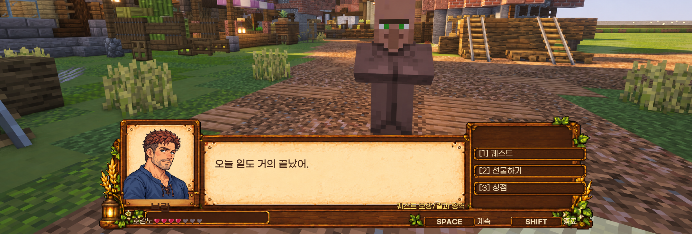

# NPC와 퀘스트

MineValley의 NPC는 기능을 제공하는 상점 NPC와, 성격·관계·생활 동선과 퀘스트를 가진 주민으로 나뉩니다. 현재 주민 45명이 등록되어 있으며 모두 월드에 배치되어 있습니다.

위 이미지는 대화 화면의 디자인 미리보기입니다. 표시되는 선택지는 주민마다 다르므로 현재 게임 화면을 확인하세요.

## 상점 NPC와 마을 주민

| 종류 | 주된 역할 |
| --- | --- |
| 상점 NPC | 정해진 상점이나 교환 기능 제공 |
| 마을 주민 | 발견, 대화, 관계, 선물과 개인 퀘스트 제공 |

모든 NPC가 같은 기능을 제공하지는 않습니다. 상점 NPC에게 주민 관계 기능이 없거나, 주민마다 이용 가능한 대화와 퀘스트가 다를 수 있습니다.

## 주민과 할 수 있는 일

- 처음 만난 주민 발견
- 대화와 기본 정보 확인
- 관계와 호감도 확인
- 선물
- 주민의 역할과 위치 확인
- 이용 가능한 퀘스트 확인, 수락과 보고

주민마다 제공하는 대화와 기능은 다릅니다. 모든 주민이 퀘스트나 같은 상호작용을 제공하는 것은 아닙니다. 자세한 명단과 생활 구역은 [마을 주민](residents/README.md)에서 확인하세요.

## 퀘스트 종류

### 전직 퀘스트

직업 선택이나 승급과 연결되는 고정 퀘스트입니다. 담당 주민과 직업 화면의 실제 안내를 따라 진행합니다.

### 주민 개인 퀘스트

주민의 성향과 관계, 플레이어의 상태에 맞춰 제안되는 개인 퀘스트입니다. 목표 수량과 만료 조건을 확인한 뒤 수락하세요.

### 방랑가 의뢰

방랑가의 성장과 연결되는 주민 요청입니다. 열람이나 수락만으로 보상이 지급되지 않으며, 조건을 채워 완료해야 합니다.

### 섬 퀘스트

같은 섬의 구성원이 함께 납품하는 공동 목표입니다. [섬 기여도와 섬 퀘스트](island-village/contribution-and-quests.md)에서 확인할 수 있습니다.

## 완료와 보고

목표를 모두 채웠더라도 퀘스트에 따라 주민에게 직접 보고해야 완료될 수 있습니다. 목표 완료 표시와 실제 보상 수령을 함께 확인하세요.
