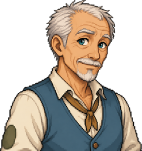

# 월터

나이가 들어도 세상의 변화가 여전히 재미있어 모르는 것을 거리낌 없이 묻는 호기심 많은 할아버지.

## 어떤 주민인가요?

| 구분 | 소개 |
| --- | --- |
| 생활 구역 | 언덕 마을 |
| 역할 | 없음 |
| 성격 | 호기심, 능청스러움, 배움, 새벽 산책, 끈기, 체력 과신 |

## 만나러 가기

월터의 기본 생활 구역은 언덕 마을입니다. 주민은 하루 일정에 따라 이동하므로, 한 지점을 고정 위치로 생각하기보다 [마을 주민 안내](../README.md)를 참고해 생활 구역에서 찾아보세요.

대화를 걸면 현재 제공하는 기능을 확인할 수 있습니다. 대화·선물·퀘스트는 주민과 진행 상태에 따라 다르며, 실제 대화 화면의 안내를 따라 이용하세요.

관련 문서: [주민 전체 명단](../README.md) · [NPC와 퀘스트](../../npc-quests.md) · [방랑가](../../jobs/wanderer.md)
