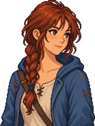

# 나디아

어디서든 금방 살아갈 방법을 찾지만 자신이 돌아오기를 기다리는 사람과 관계를 이어 가는 방법은 아직 배우지 못한 젊은 방랑가.

## 어떤 주민인가요?

| 구분 | 소개 |
| --- | --- |
| 생활 구역 | 벽돌 마을 |
| 역할 | 방랑가, 로웬의 잡화점 비정기 보조 |
| 성격 | 적응력, 붙임성, 현실적인 유머, 가벼운 짐, 불확실한 귀환, 독립성, 돌아올 장소 |

## 만나러 가기

나디아의 기본 생활 구역은 벽돌 마을입니다. 주민은 하루 일정에 따라 이동하므로, 한 지점을 고정 위치로 생각하기보다 [마을 주민 안내](../README.md)를 참고해 생활 구역에서 찾아보세요.

대화를 걸면 현재 제공하는 기능을 확인할 수 있습니다. 대화·선물·퀘스트는 주민과 진행 상태에 따라 다르며, 실제 대화 화면의 안내를 따라 이용하세요.

관련 문서: [주민 전체 명단](../README.md) · [NPC와 퀘스트](../../npc-quests.md) · [방랑가](../../jobs/wanderer.md)
