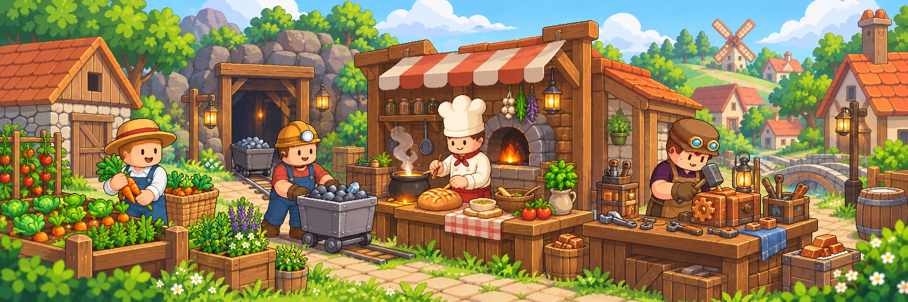

# 생산과 생활

**무엇을 준비하고, 어떤 순서로 생산하는지** 찾는 곳입니다. 메뉴 위치와 보관 기능은 [메뉴·편의 기능](../guides/README.md), 직업 레벨과 해금 조건은 [직업과 성장](../jobs/README.md)에서 확인하세요.

## 오늘 할 일 고르기

<table data-view="cards"><thead><tr><th></th><th></th><th data-hidden data-card-target data-type="content-ref"></th></tr></thead><tbody>
<tr><td><strong>농사 — 씨앗에서 수확까지</strong></td><td>밭·씨앗·물을 준비하고 성장 상태를 확인해요.</td><td><a href="farming.md">농사</a></td></tr>
<tr><td><strong>채광 — 직접 캐기와 잠광</strong></td><td>곡괭이를 준비하고 활동별 보관 경로를 구분해요.</td><td><a href="mining.md">광산과 잠광</a></td></tr>
<tr><td><strong>가공 — 재료에서 완성품까지</strong></td><td>품목에 맞는 시설과 레시피를 확인해요.</td><td><a href="processing.md">가공</a></td></tr>
<tr><td><strong>기술 — 조립에서 설비 운용까지</strong></td><td>작업대·부품을 준비하고 공급 상태를 확인해요.</td><td><a href="technology.md">기술 설비</a></td></tr>
</tbody></table>

처음 시작한다면 농사나 직접 채광 하나부터 경험해 보세요. 가공과 조립은 현재 이용 가능한 레시피와 시설을 확인한 뒤 진행합니다.

## 생산물이 생긴 다음에는

| 다음에 할 일 | 이어서 볼 안내 |
| --- | --- |
| 다른 제품의 재료로 쓰기 | [생산과 수요의 연결](production-chain.md) |
| 판매하거나 주문에 납품하기 | [경제와 거래](../economy/README.md) |
| 섬원과 공동 목표에 참여하기 | [섬과 마을](../island-village/README.md) |
| 주민이 필요한 물건 확인하기 | [NPC와 퀘스트](../npc-quests.md) |

개인 섬은 기본 생산과 섬원 활동의 중심이고, 마을은 상점·주민·주요 시설을 만나는 공간입니다. 활동의 차이를 먼저 비교하고 싶다면 [주요 활동](activities.md)을 읽어 보세요.
