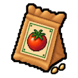

# 농사

씨앗을 심고 물을 관리해 작물을 수확하는 방법을 안내합니다.

## 시작 전에 

| 준비할 것 | 확인할 것 |
| --- | --- |
| 밭과 씨앗 | 해당 씨앗을 심을 수 있는 재배 공간 |
| 물 | 씨앗을 심은 뒤 물을 공급할 준비 |
| 보관 공간 | 수확물을 확인하고 꺼낼 공간 |


**기본 농사는 농부가 아니어도 시작할 수 있습니다.** 허브와 대형 작물은 별도의 전문 해금과 재배 조건을 확인하세요.


## 영상으로 따라가기 

<!-- MEDIA_SLOT farm-overview-video: supplied gameplay video, not an illustration. -->
<figure><figcaption>
심기 → 물 관리 → 수확·보관
</figcaption></figure>

## 첫 재배 따라가기 



### 밭과 씨앗 준비

재배할 수 있는 밭과 씨앗을 준비합니다. 일반 씨앗과 대형 씨앗은 구분해서 확인하세요.

<!-- MEDIA_SLOT farm-preparation-image -->
<figure><figcaption>
밭과 씨앗 확인
</figcaption></figure>


### 씨앗 심기

빈 밭에 씨앗을 심고, 밭의 상태를 확인합니다.

<!-- MEDIA_SLOT farm-planting-image -->
<figure><figcaption>
씨앗을 심은 밭
</figcaption></figure>


### 물을 주고 성장 확인

심은 밭에 물을 주고 성장 상태를 확인합니다. 작물은 물이 있는 밭에서 시간이 흘러야 자랍니다.

<!-- MEDIA_SLOT farm-watering-image -->
<figure><figcaption>
급수 후 밭 상태
</figcaption></figure>


**씨앗을 심은 뒤 물 상태를 다시 확인하세요.** 비어 있는 밭에 미리 준 물은 새로 심은 작물의 성장 시간으로 그대로 이어지지 않습니다.



### 다 자란 작물 수확

수확 가능한 상태가 된 작물을 수확합니다. 품질과 보관 상태를 확인하고 다음 사용처를 정하세요.

<!-- MEDIA_SLOT farm-harvest-image -->
<figure><figcaption>
수확 상태와 결과
</figcaption></figure>


### 농작물창고에서 확인

농작물창고는 지원되는 작물을 모아 두는 전용 공간입니다. 수확물을 확인하고 필요할 때 꺼내 가공·거래·납품에 사용합니다. 일반 창고와 저장 대상이 다르므로 [보관 공간 비교](../guides/storage-and-mail.md)도 확인하세요.

<!-- MEDIA_SLOT farm-storage-image -->
<figure><figcaption>
보관한 수확물 확인
</figcaption></figure>



## 재배 작물

현재 농사 시스템에서 다루는 일반 작물과 허브는 다음과 같습니다.

| 분류 | 작물 |
| --- | --- |
| 일반 작물 | 보리, 콩, 블루베리, 양배추, 옥수수, 오이, 마늘 |
| 일반 작물 | 포도, 상추, 올리브, 양파, 무, 딸기, 토마토 |
| 허브 | 캐모마일, 히비스커스, 자스민, 라벤더 |
| 허브 | 레몬그라스, 페퍼민트, 로즈힙, 로즈마리 |

허브 재배는 농부 성장 과정에서 열리는 전문 영역입니다. 작물별 성장 시간과 계절 효과, 해금 조건은 조정될 수 있으므로 게임 안의 씨앗과 농사 화면에 표시된 정보를 기준으로 판단하세요.

2026년 9월 11일 LIVE 운영본에는 재배 작물 22종과 각 작물의 일반·대형 씨앗을 합친 씨앗 44종이 등록되어 있습니다.

## 성장 상태와 품질

작물은 여러 성장 모습을 거쳐 수확 가능한 상태가 됩니다. 수확물에는 품질 차이가 생길 수 있으며, 품질은 가공·거래·납품에서 가치 차이로 이어질 수 있습니다.

<!-- MEDIA_SLOT farm-growth-comparison-image -->
<figure><figcaption>
성장 중인 모습과 수확 가능한 모습 비교
</figcaption></figure>

품질 단계와 발생 확률은 밸런스 조정 대상입니다. 위키에서는 확정되지 않은 확률표를 먼저 공개하지 않습니다.

## 대형 작물

대형 작물은 **전용 씨앗과 별도의 재배 조건**을 가진 콘텐츠입니다. 필요한 공간과 밭 상태를 확인한 뒤 심어야 합니다.

| 일반 토마토 씨앗 | 대형 토마토 씨앗 |
| --- | --- |
|  |  |

위 그림은 씨앗 아이템을 구분하는 예시입니다. 성장 중인 작물의 모습은 아닙니다.


일반 작물을 오래 두거나 우연히 성장시키는 것만으로 대형 작물이 되지는 않습니다.


## 농사 장비

농사는 손으로 물을 주고 상태를 확인하는 단계에서 여러 설치 장비를 활용하는 방식으로 확장됩니다.

| 장비 | 역할 | 현재 단계 |
| --- | --- | --- |
| 스프링클러 | 범위 안의 밭에 물 공급 | 5단계 |
| 성장 알리미 | 지정한 재배 구역의 상태 확인 | 4단계 |
| 허수아비 | 주변 작물의 생육 보조 | 5단계 |

현재 급수 한 주기는 게임 안의 하루를 기준으로 흐르며, 서버가 꺼져 있는 동안에는 시간이 진행되지 않습니다. 장비별 범위와 용량은 등급에 따라 달라지므로 설치 전 아이템 설명을 확인하세요.

## 작물이 안 자라요 

| 확인 순서 | 살펴볼 내용 |
| --- | --- |
| 물 공급 | 씨앗을 심은 뒤 밭에 물을 주었나요? |
| 성장 상태 | 아직 성장 중인가요, 이미 수확 가능한가요? |
| 재배 조건 | 씨앗의 재배 조건과 직업 해금 조건을 갖췄나요? |

밭을 반복해서 부수기 전에 현재 화면을 촬영해 [문의 안내](../help/README.md)에 따라 알려 주세요.

## 수확 다음에는 

<table data-view="cards"><thead><tr><th></th><th></th><th data-hidden data-card-target data-type="content-ref"></th></tr></thead><tbody>
<tr><td><strong>다음에 키울 작물 찾기</strong></td><td>작물 그림과 가공 사용처를 확인해요.</td><td><a href="../atlas/crops.md">작물 도감</a></td></tr>
<tr><td><strong>수확물 가공하기</strong></td><td>재료를 음식과 음료로 만드는 방법을 알아봐요.</td><td><a href="processing.md">가공</a></td></tr>
<tr><td><strong>첫 판매 확인하기</strong></td><td>주민 상점의 취급 품목과 판매 가능 여부를 확인해요.</td><td><a href="../economy/npc-shops.md#first-sale">첫 판매</a></td></tr>
</tbody></table>

직업 성장과 전문 해금은 [농부](../jobs/farmer.md), 활동 간 연결은 [생산과 수요의 연결](production-chain.md)에서 확인하세요.
